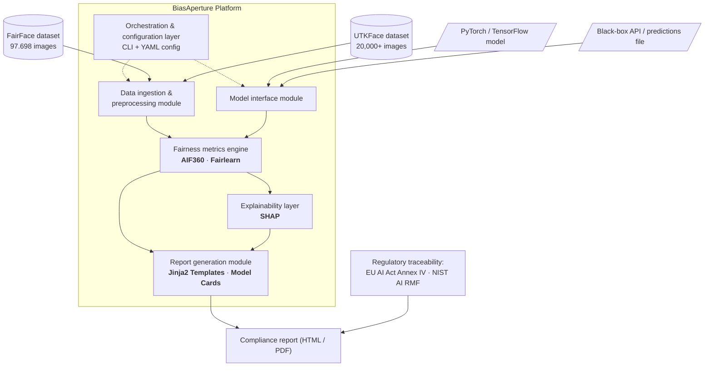

# BiasAperture

- A Diagnostic and Evaluative Framework for Auditing Demographic Bias in Facial Analysis Systems \*

A fairness and bias audit system proposal report submitted for the Fusemachines AI Fellowship Program, Kathmandu, Nepal.

**Authors:** Aaradhya Dev Tamrakar, Tisha Manandhar
**Supervisor:** Shreejan Kisee, Teaching Assistant, Fusemachines AI Fellowship

## Abstract

BiasAperture is a diagnostic and evaluative software platform that computes subgroup and intersectional fairness metrics for a third-party facial-analysis model and reports them in a standardised, regulator-legible format. It is organised into five cooperating modules covering data ingestion, model interfacing, fairness-metric computation, explainability, and report generation. Its analytical core computes four disparity metrics — demographic parity difference, equalized odds difference, equal opportunity difference, and disparate impact ratio — using AIF360 and Fairlearn as independent, cross-validating backends, with every reported disparity accompanied by a chi-squared significance test and a bootstrap confidence interval. The current explainability implementation uses demographic-dummy surrogate attribution; richer spatial SHAP and ITA analysis remain deferred. Findings are traced to their specific basis under Article 10 of the EU AI Act and the corresponding function of the NIST AI Risk Management Framework. The current case study uses FairFace; UTKFace was profiled and cut from the implementation scope. BiasAperture is scoped strictly as diagnostic: it does not mitigate bias, retrain models, or generate synthetic demographic data.

## System Architecture

The platform is coordinated by a CLI + YAML **orchestration and configuration layer** that drives two parallel intake paths and a linear downstream analysis pipeline:



* **Data ingestion & preprocessing module** — consumes the FairFace (108,501 images) and UTKFace (20,000+ images, evaluated then formally cut per Cut-List #2) datasets and normalises them into the locked M1 schema. Implemented in `src/bias_aperture/schema.py` and the ingestion pipeline under `src/bias_aperture/`.
* **Model interface module** — abstracts over the subject under audit, accepting either a PyTorch/TensorFlow model, a black-box API, or a static predictions file. Implemented in `src/bias_aperture/model_interface.py` (`ModelInterface` & `PredictionsFileInterface`).
* **Fairness metrics engine** — computes the Core Four disparity metrics (demographic parity difference, equalized odds difference, equal opportunity difference, disparate impact ratio) using **AIF360** and **Fairlearn** as independent, cross-validating backends, each result paired with a $\chi^2$ significance test and a BCa bootstrap confidence interval. Implemented in `src/bias_aperture/fairness/` (WP4).
* **Explainability layer** — attributes flagged disparities to input features via **SHAP**.
* **Report generation module** — renders findings into offline, zero-network **Jinja2**-templated HTML/PDF compliance reports with accompanying model cards. Implemented in `src/bias_aperture/report/` (WP3).
* **Compliance report** — the final artifact, with every finding traced to its specific basis under **EU AI Act Annex IV** and the corresponding **NIST AI RMF** function.

## Repository Structure

```BiasAperture/
├── .github/                    # GitHub configuration & PR templates
│   └── pull_request_template.md
├── .pre-commit-config.yaml     # Pre-commit hooks (Ruff, formatting, file-size guards)
├── pyproject.toml              # PEP 517/621 package spec & tool configs (Ruff, pytest)
├── uv.lock                     # Deterministic dependency lockfile
├── data/                       # Datasets and test matrices (raw/ and processed/ gitignored)
│   └── README.md               # Dataset sourcing and FairFace setup instructions
├── dev-logs/                   # Dated developer logs & master audit walkthroughs
├── research/                   # Phase 1 and Phase 2 research work
│   ├── research tracks/        # Track prompts and runner/context guides (Tracks 01–38)
│   ├── context feed/           # Context documents feeding the original sprint
│   └── results/                # Phase syntheses and cross-track conflict logs
├── scripts/                    # Dataset exploration and verification scripts
│   ├── explore_fairface.py     # FairFace disk verification & attribute profiling
│   └── explore_utkface.py      # UTKFace comparison & DEX noise analysis
├── report/                     # LaTeX report source and compiled proposal
│   ├── main.tex                # Entry point
│   ├── vars.tex                # Title, authors, supervisor metadata
│   ├── at_fuse_aif.cls         # Document class
│   ├── references.bib
│   ├── main.pdf                # Compiled proposal (tracked; build artifacts are not)
│   └── src/                    # Frontmatter, chapters, backmatter, images
├── specs/                      # Numbered implementation-facing specifications
│   ├── 00-overview-and-mvp-scope.md
│   ├── 01-architecture.md
│   ├── 02-data-model.md
│   ├── 03-orchestrator.md
│   ├── 04-intake-and-classification.md
│   ├── 05-audit-engine.md
│   ├── 06-statistics-and-confidence.md
│   ├── 07-explainability.md
│   ├── 08-report-and-compliance.md
│   ├── 09-verification.md
│   ├── 10-security-and-governance.md
│   └── 11-requirements-traceability.md
├── docs/                       # TA/reviewer-facing meta-documentation
│   ├── BiasAperture-AT.md      # Master project planning and task assignments (v10)
│   ├── PROPOSAL_DEFENSE_GUIDE.md # Comprehensive Viva defense Q&A guide
│   ├── PRE_PROPOSAL_READING_GUIDE.md # Reading guide & executive brief
│   ├── BiasAperture_NOVELTY_INTEGRATION_DEFENSE.md # Novelty & prior-art defense
│   ├── schema-lock-m1.md       # Milestone M1 schema specification
│   ├── literature-review-matrix.md   # Paper matrix (9 papers, Walden format)
│   ├── CHANGELOG.md            # Auto-updated by sync.ps1 on each sync
│   └── fellowship/             # Official AIF guidelines & reference PDFs
├── vendor/                     # Offline TeX dependencies
├── src/                        # Implementation package:
│   ├── bias_aperture/          # Core package
│   │   ├── schema.py           # Locked demographic and metric schema (M1)
│   │   ├── model_interface.py  # ModelInterface & PredictionsFileInterface
│   │   ├── data_ingestion.py   # FairFace ingestion & validation pipeline
│   │   ├── explainability.py   # SHAP & ITA explainability layer
│   │   ├── cli.py              # CLI entry point orchestrator (`bias-aperture`)
│   │   ├── fairness/           # WP4 detection engine package
│   │   └── report/             # WP3 report generation package
│   └── tests/                  # Automated pytest unit test suite (conftest.py, tests)
├── sync.ps1                    # Local git workflow: stage, conventional-commit, pull --rebase, push
├── LICENSE                     # MIT
├── AGENT.md                    # Universal AI agent & developer guidelines
├── CLAUDE.md                   # Claude assistant instructions
├── ANTIGRAVITY.md              # Google Antigravity & Gemini instructions
└── README.md
```

## Research Sprints

The original capstone research sprint covered Tracks 01–20 and produced the
three-level design documents under [`docs/research/`](docs/research/). The
follow-on **Phase-2 Product Upgrade Sprint** covers Tracks 21–38 and studies
the evolution from a capstone CLI to a product-ready audit platform. Its
research-only synthesis is [`research/results/synth_phase2.md`](research/results/synth_phase2.md),
with execution guidance in
[`research/research tracks/PHASE2_RUNNER_GUIDE.md`](research/research%20tracks/PHASE2_RUNNER_GUIDE.md)
and the track map in
[`research/research tracks/PHASE2_TASK_MAP.md`](research/research%20tracks/PHASE2_TASK_MAP.md).

Phase 2 has 16 tracks available to claim or complete. Track 22 is parked until
Tracks 25 and 36 land, and Track 23 is dropped pending resolution of its scope
conflict. Phase-2 proposals remain additive and must preserve the locked M1
schema, diagnostic-only scope, and NFR-001/002/003 statistical safeguards.

## Project Progress & Roadmap

```
Overall Progress: [██████████████████░░] 90% (Milestones M1–M4 Completed · Inference Complete · M5 Audit/Report Active; 56 tests passing)
```

| Work Package / Milestone                          | Stream / Focus            | Status    | Progress Bar                  | Deliverables & Implementation State                                                                                                                                          |
| ------------------------------------------------- | ------------------------- | --------- | ----------------------------- | ---------------------------------------------------------------------------------------------------------------------------------------------------------------------------- |
| **WP1 / M1: Schema Lock & Baseline**              | Foundations / Joint       | Completed | `[████████████████████] 100%` | Locked schema (`schema.py`), FairFace ResNet-34 baseline fixed, test fixtures                                                                                                |
| **WP2 / M2: Data Ingestion & Test Matrix**        | Stream A (Tisha)          | Completed | `[████████████████████] 100%` | FairFace ingestion pipeline (`data_ingestion.py`), disk verification (97,698 images), UTKFace profiling                                                                      |
| **WP3 / M3: Compliance Report Generation**        | Stream B (Tisha/Aaradhya) | Completed | `[████████████████████] 100%` | Offline standalone Jinja2 HTML report (`generator.py`), embedded Base64 charts, EU AI Act & NIST mapping                                                                     |
| **WP4 / M4: Statistical Detection Engine & SHAP** | WP4 (Aaradhya)            | Completed | `[████████████████████] 100%` | Pure-math metrics, Fairlearn + native AIF360 backends, BCa bootstrap ($B \ge 1,000$), $\chi^2$ significance tests, SHAP surrogate attribution                                |
| **WP5 / M5: System Orchestration & Case Study**   | Integration / Joint       | Active    | `[██████████████████░░]  90%` | Benchmark inference complete (`10,954/10,954` processed), CSV schema validated, and gender audit report generated; next: review report outputs and finalize empirical tables |

### Current TODOs (September 2, 2026)

**Aaradhya**

- [x] Run the FairFace gender audit with explicit CSV column mappings; generated `report/audit_report_val_gender.html` with 10,954 records and 12 metric rows.

  ```powershell
  uv run bias-aperture --predictions-file data/processed/fairface_predictions_val.csv --protected-attr gender --true-label-col true_gender --predicted-label-col predicted_gender --race-col subgroup_race --gender-col subgroup_gender --age-col subgroup_age --output-report report/audit_report_val_gender.html
  ```

- [ ] Verify the standalone HTML report includes DPD, DIR, EOP, EOD, 95% bootstrap CIs, chi-squared p-values, sample sizes, and `n < 30` guards.
- [ ] Finalize `report/main.pdf` with empirical tables, confidence intervals, p-values, and disparity visualizations.
- [ ] Seal reproducible empirical claims in `docs/research/CLAIM_LEDGER.md`.

**Tisha**

- [ ] Confirm defense date, duration, format, and marking breakdown with TA Shreejan Kisee.
- [ ] Audit the generated Model Card and Datasheet against EU AI Act Articles 10 and 13.
- [ ] Verify all 126 race × age × gender bins and document sample-size enforcement.
- [ ] Prepare the dataset and compliance sections for the defense.

**Joint**

- [ ] Confirm timeline and dependencies after the TA responds.
- [ ] Create the 10–15 minute presentation and rehearse the end-to-end CLI demo.
- [ ] Practice scrutiny questions on the `n ≥ 30` guard, chi-squared testing, bootstrap CIs, backend differences, and diagnostic-only scope.

### Questions for the TA

- What are the confirmed defense date, duration, and required format?
- Must both team members present, and how are individual contributions assessed?
- Are slides, a live demonstration, or both required?
- Is FairFace alone sufficient, allowing UTKFace to be removed from the final scope?
- Do the CLI and offline HTML report satisfy the deliverable requirements?
- Are Fairlearn, AIF360, and SHAP all mandatory, or can some be presented as focused validation components?
- What is the confirmed final deadline and are there interim milestones?
- Which evidence is expected: tests, profiling, metric results, generated report, runtime measurements, and end-to-end audit?

## Branching & Workstreams

| Branch                 | Stream / Work Package | Primary Owner                    | Description                                                                                        |
| ---------------------- | --------------------- | -------------------------------- | -------------------------------------------------------------------------------------------------- |
| `main`                 | Production / Base     | Joint                            | Stable base holding locked schema, verified engine, docs, and report                               |
| `feat/stream-data`     | Stream A (WP2)        | Tisha (`@tiixsha`)               | FairFace dataset ingestion & test-matrix construction                                              |
| `feat/stream-report`   | Stream B (WP3)        | Tisha (`@tiixsha`)               | Jinja2 HTML compliance report scaffolding                                                          |
| `feat/wp4-engine`      | WP4                   | Aaradhya (`@AaradhyaDT`)         | Fairness computation backends, statistics, and SHAP                                                |
| `feat/wp5-integration` | WP5                   | Aaradhya (`@AaradhyaDT`) / Joint | CLI orchestrator, benchmark execution & case study                                                 |
| Branch                 | Stream / Work Package | Primary Owner                    | Target Focus & Verification Mandate                                                                |
| ---------------------- | --------------------- | -------------------------        | -------------------------------------------------------------------------------------------------- |
| `main`                 | Production / Base     | Joint                            | Stable base holding M1 schema, documentation, and LaTeX report                                     |
| `feat/stream-data`     | Stream A (WP2)        | Tisha (`@tiixsha`)               | FairFace dataset ingestion, `dlib` 5-point landmark alignment & demographic test-matrix            |
| `feat/stream-report`   | Stream B (WP3)        | Tisha (`@tiixsha`)               | Jinja2 HTML compliance report scaffolding, zero-network offline rendering, EU AI Act mapping       |
| `feat/wp4-engine`      | Stream C (WP4)        | Aaradhya (`@AaradhyaDT`)         | Fairness backends harmonization (AIF360 + Fairlearn), BCa bootstrap CIs, and $\chi^2$ significance |
| `feat/wp5-integration` | Stream D (WP5)        | Aaradhya (`@AaradhyaDT`)         | SHAP explainability layer, pipeline orchestration, and end-to-end benchmark case studies           |

## Research Verification & Viva Defense Allocation

Empirical claims are verified across independent audit streams as detailed in the [Verification & Scrutiny Guide](docs/research/VERIFICATION_AND_SCRUTINY_GUIDE.md):

* **Tisha Manandhar**: Leads defense on Dataset Integrity (FairFace 97.7k count verification & alignment), Demographic Test Matrix Scaffolding, Regulatory Alignment (EU AI Act Art. 10/13 & NIST AI RMF Measure 2.11), and Standalone Compliance Reporting.
* **Aaradhya Dev Tamrakar**: Leads defense on Statistical Significance Engine ($\chi^2$ asymptotic tests, BCa Bootstrap Confidence Intervals), Dual-Backend Harmonization (AIF360 vs Fairlearn Equalized Odds max-of-gaps), and SHAP Feature Attribution.

## Python Development, Testing & Code Style

The project follows the [Khwopa / TA Engineering Standards](https://github.com/Khwopa-College-of-Engineering-KHCE/Image-Super-Resolution/tree/standards) for Python code style and testing:

```bash
# Run unit test suite
uv run --extra dev pytest

# Run linter and auto-formatter
uv run --extra dev ruff check --fix
uv run --extra dev ruff format

# Install pre-commit hooks (optional for local commits)
pre-commit install
```

## Local Git Workflow & Auto-Sync (`sync.ps1`)

```powershell
.\sync.ps1                                  # stage all, conventional-commit, pull --rebase, push
.\sync.ps1 -m "feat(scope): detailed summary"  # same, with an explicit commit message
.\sync.ps1 -PullOnly                        # git pull --autostash only, no commit/push
```

Every run (except `-PullOnly`) appends a timestamp entry to `docs/CHANGELOG.md` before committing. The project is now synced from the verified inference-completion state, with session notes stored under `dev-logs/` using the dated naming convention.

## Building the Report

Requires a full TeX Live distribution (the class pulls in `booktabs`, `array`, `glossaries`, `newtxmath`, `siunitx`, `algorithmicx`, and others).

```bash
cd report
pdflatex -interaction=nonstopmode main.tex
makeglossaries main
bibtex main
pdflatex -interaction=nonstopmode main.tex
pdflatex -interaction=nonstopmode main.tex
```

The `makeglossaries` step is required — it sorts the raw abbreviation and symbol entries the class writes during the first pass into the `.acr`/`.sls` files the later passes typeset. Skipping it leaves the List of Abbreviations and List of Symbols pages blank. Overleaf runs this automatically; a plain local `pdflatex` invocation does not unless your editor or `latexmkrc` is configured to call it.

If `newtxmath.sty`, `IEEEtran.bst`, or `binhex.tex` are reported missing, install the corresponding package from `vendor/` into your local TeX tree (or via `tlmgr`/your package manager) rather than editing the source.

Build artifacts (`.aux`, `.bbl`, `.toc`, `.synctex.gz`, etc.) are git-ignored; only the source and the compiled `report/main.pdf` are tracked.

## VS Code Setup

Recommended extensions for editing/compiling `report/`:

- **[LaTeX Workshop](https://marketplace.visualstudio.com/items?itemName=James-Yu.latex-workshop)** (James Yu) — compile, preview, autocomplete, SyncTeX
- **[LaTeX Utilities](https://marketplace.visualstudio.com/items?itemName=tecosaur.latex-utilities)** (tecosaur) — glossary/word-count add-ons on top of Workshop

Skip generic "LaTeX" language-support extensions (e.g. Mathematic Inc's) — redundant with Workshop and can conflict on snippets/keybindings.

Workshop's default recipes don't run `makeglossaries`, which this build requires (see above). Add a custom recipe in `.vscode/settings.json`:

```json
{
  "latex-workshop.latex.tools": [
    {
      "name": "pdflatex",
      "command": "pdflatex",
      "args": ["-interaction=nonstopmode", "-synctex=1", "%DOC%"]
    },
    {
      "name": "makeglossaries",
      "command": "makeglossaries",
      "args": ["%DOCFILE%"]
    },
    {
      "name": "bibtex",
      "command": "bibtex",
      "args": ["%DOCFILE%"]
    }
  ],
  "latex-workshop.latex.recipes": [
    {
      "name": "pdflatex ➔ makeglossaries ➔ bibtex ➔ pdflatex ×2",
      "tools": ["pdflatex", "makeglossaries", "bibtex", "pdflatex", "pdflatex"]
    }
  ],
  "latex-workshop.latex.recipe.default": "lastUsed",
  "latex-workshop.latex.outDir": "%DIR%"
}
```

Set `report/main.tex` as the root file if Workshop doesn't auto-detect it.

## License

MIT — see [LICENSE](LICENSE).
