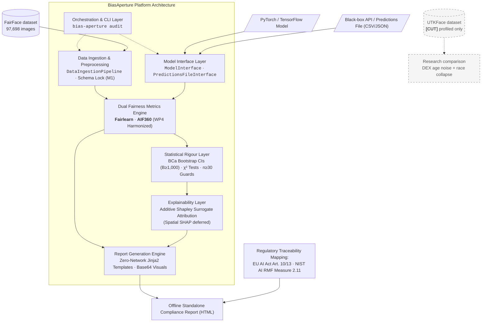

# BiasAperture

**A Diagnostic and Evaluative Framework for Auditing Demographic Bias in Facial Analysis Systems**

A fairness and bias audit system proposal and implementation submitted for the **Fusemachines AI Fellowship Program**, Kathmandu, Nepal.

**Authors:** Aaradhya Dev Tamrakar, Tisha Manandhar  
**Supervisor:** Shreejan Kisee, Teaching Assistant, Fusemachines AI Fellowship  
**Status:** Milestones M1–M4 Completed (100%) · M5 System Orchestration & Case Studies Active (90%) · 67/67 Tests Passing

---

## Abstract

BiasAperture is a diagnostic and evaluative software platform that computes subgroup and intersectional fairness metrics for third-party computer vision models and outputs standardized, regulator-legible compliance reports. Organised into five modular tiers (data ingestion, model interfacing, dual fairness computation, surrogate explainability, and report generation), the analytical core computes the **Core Four** disparity metrics:

1. **Demographic Parity Difference (DPD)**
2. **Disparate Impact Ratio (DIR)**
3. **Equal Opportunity Difference (EOP)**
4. **Equalized Odds Difference (EOD)**

To eliminate single-library implementation bias, BiasAperture employs **AIF360** and **Fairlearn** as independent, cross-validating backends with mathematical harmonization (reconciling sign conventions, zero-denominator contracts, and max-of-gaps formulations). Every reported disparity is accompanied by a **Pearson's $\chi^2$ independence test** (with **Fisher's exact test fallback** for sparse $2\times2$ tables when any expected cell count $< 5$), a **95% BCa Bootstrap Confidence Interval** ($B \ge 1,000$ resamples), and strict sample-size guards ($n < 30$ suppressed).

Flagged disparities are attributed to demographic proxy axes using exact **additive Shapley surrogate attribution** (spatial SHAP and ITA colorimetry deferred). All audit findings are mapped to **Article 10 and Article 13 of the EU AI Act** and **NIST AI RMF 1.0 (Measure 2.11)**. Empirical validation is conducted on the **FairFace benchmark (97,698 images)**; UTKFace was evaluated and formally cut from the runtime scope due to label noise.

---

## Non-Negotiable Diagnostic Scope

In accordance with fellowship research guidelines and architectural invariants:

- **Strictly Diagnostic & Evaluative**: BiasAperture measures, attributes, and reports demographic disparities. It **does NOT** perform model retraining, in-processing weights debiasing, fine-tuning, or synthetic image generation.
- **Statistical Integrity**: Subgroups with $n < 30$ samples are never assigned computed metric values; they are marked with `insufficient_sample=True` and `metric_value=None` (enforced by `MetricResult.__post_init__`).
- **Zero-Network Offline Execution**: The entire pipeline, from tabular intake to standalone Jinja2 HTML report compilation, operates in air-gapped/offline environments with zero external CDN dependencies.

---

## System Architecture

The platform is coordinated by a unified CLI orchestration engine (`src/bias_aperture/cli.py`) that drives dual intake paths and a deterministic downstream auditing pipeline:



### Core Architecture Components

1. **Data Ingestion & Invariant Validation (`src/bias_aperture/data_ingestion.py`)**: Validates demographic datasets against the locked M1 schema (`src/bias_aperture/schema.py`), enforces column alias resolution, filters missing labels, profiles cohort supports, and detects intersectional sample starvation ($n < 30$).
2. **Model Interface (`src/bias_aperture/model_interface.py`)**: Abstract contract (`ModelInterface`) supporting batch predictions files (`PredictionsFileInterface`) and live in-process PyTorch/TensorFlow wrappers (`InProcessInterface`).
3. **Fairness Metrics Engine (`src/bias_aperture/fairness/`)**: Dual backend strategy pattern (`FairlearnBackend` and `AIF360Backend`) cross-validating the Core Four metrics with OvR multi-class decomposition (`OvRTransformer`).
4. **Statistical Rigour & Safeguards (`src/bias_aperture/fairness/statistics.py`)**: Computes 95% BCa bootstrap confidence intervals ($B = 1,000$), Pearson's $\chi^2$ independence tests with Fisher's exact test fallback for sparse $2\times2$ tables (expected cell count $< 5$), Holm-Bonferroni FWER adjustment, and divergence alerts across backends ($|\Delta| > 0.01$).
5. **Targeted Explainability (`src/bias_aperture/explainability.py`)**: Triggers only on statistically flagged disparities to compute additive Shapley feature importances across demographic proxy axes.
6. **Compliance Report Generator (`src/bias_aperture/report/generator.py`)**: Offline HTML compiler embedding interactive CSS, self-contained SVG/Base64 plots, model card metadata, and regulatory compliance matrices.

---

## Repository Structure

```
BiasAperture/
├── .github/                    # GitHub configuration, issue and PR templates
│   └── pull_request_template.md
├── .pre-commit-config.yaml     # Pre-commit hooks (Ruff linter, formatter, size guards)
├── pyproject.toml              # PEP 517/621 package spec, dependencies & tool configs
├── uv.lock                     # Deterministic dependency lockfile (uv)
├── data/                       # Dataset storage (raw/ and processed/ gitignored)
│   ├── README.md               # Dataset download, sourcing, and alignment instructions
│   └── processed/              # Validation predictions (e.g. fairface_predictions_val.csv)
├── dev-logs/                   # Dated engineering logs & milestone audit trails
│   ├── weekly-reports/         # Formal Weekly Reports WK1–WK5 (Markdown & PDF)
│   └── *_session_*.md          # Developer walkthrough and synchronization sessions
├── docs/                       # Reviewer-facing meta-documentation & specifications
│   ├── PROPOSAL_DEFENSE_MASTER_DOSSIER.md # AUTHORITATIVE defense doc — rubric-mapped (Parts 1–5)
│   ├── PROPOSAL_DEFENSE_GUIDE.md          # Earlier Viva Q&A guide (retained for reference)
│   ├── PRE_PROPOSAL_READING_GUIDE.md      # Earlier conceptual reading guide (retained for reference)
│   ├── PRESENTATION_DISCREPANCY_NOTES.md  # Slide-deck discrepancy findings vs. repo ground truth
│   ├── BiasAperture_NOVELTY_INTEGRATION_DEFENSE.md # Defensible novelty & competitor matrix
│   ├── DATA_GOVERNANCE.md                 # Data licensing, privacy, and ethics protocol
│   ├── schema-lock-m1.md                  # Milestone M1 locked schema specification
│   ├── literature-review-matrix.md        # Academic literature matrix (20 papers, Walden format, synchronized with thesis Chapter 2)
│   ├── CHANGELOG.md                       # Auto-updated by sync.ps1 on every commit
│   ├── research/                          # Research syntheses, CLAIM_LEDGER, SHAP theory & audit guide
│   └── fellowship/                        # Official Fusemachines guidelines & reference rubrics
├── presentation/               # Proposal Defense Slide Deck (LaTeX Beamer)
│   ├── main.tex                # 18-slide Beamer presentation entry point
│   ├── main.pdf                # Compiled defense presentation deck
│   ├── build.ps1               # Automated PowerShell compile script
│   ├── beamer_theme_fuse.sty   # Custom Fusemachines corporate/academic theme
│   ├── speaker_notes.md        # Slide-by-slide script, timing, and talking points
│   └── slides/                 # Modular slide source files (slide01 to slide18)
├── report/                     # Comprehensive Proposal LaTeX Report & Generated Audits
│   ├── main.tex                # Academic proposal entry point
│   ├── main.pdf                # Compiled LaTeX proposal document
│   ├── vars.tex                # Document metadata, titles, and team details
│   ├── at_fuse_aif.cls         # Custom Khwopa/AIF LaTeX document class
│   ├── references.bib          # BibTeX bibliography
│   ├── audit_report_val_gender.html             # Generated validation audit report (Gender)
│   ├── audit_report_val_race_gender_shap.html   # Generated validation audit report (Race x Gender + SHAP)
│   └── src/                    # Proposal chapters, frontmatter, and architectural figures
├── research/                   # 20-Track Parallel Research Sprint & NotebookLM Context
│   ├── research tracks/        # Track prompts and deliverables (Tracks 01–20)
│   ├── context feed/           # Context feeds and background documentation
│   └── results/                # Synthesis documents (Streams A–F) and conflict logs
├── specs/                      # Modular Technical Specifications
│   ├── 00-overview-and-mvp-scope.md
│   ├── 01-architecture.md
│   ├── 02-data-model.md
│   ├── 03-orchestrator.md
│   ├── 04-intake-and-classification.md
│   ├── 05-audit-engine.md
│   ├── 06-statistics-and-confidence.md
│   ├── 07-explainability.md
│   ├── 08-report-and-compliance.md
│   ├── 09-verification.md
│   ├── 10-security-and-governance.md
│   └── 11-requirements-traceability.md
├── graphify-out/               # Automated Codebase Knowledge Graph & Diagnostics
│   ├── graph.html              # Interactive browser-based graph visualizer
│   ├── graph.json              # GraphRAG-ready graph dataset
│   └── GRAPH_REPORT.md         # Plain-language architecture audit and community report
├── scripts/                    # Utility, profiling, and verification scripts
│   ├── explore_fairface.py     # FairFace disk verification and attribute distribution
│   ├── explore_utkface.py      # UTKFace comparison & DEX noise analysis
│   └── check_stale_claims.py   # Automated assertion-verification anti-drift script
├── src/                        # Core Implementation Package
│   ├── bias_aperture/          # Production library code
│   │   ├── schema.py           # Locked internal demographic schema & result models (M1)
│   │   ├── model_interface.py  # Model abstraction (PredictionsFileInterface & InProcessInterface)
│   │   ├── data_ingestion.py   # Ingestion, validation, and cohort support profiling
│   │   ├── explainability.py   # Additive Shapley surrogate attribution layer
│   │   ├── cli.py              # CLI entry point orchestrator (`bias-aperture`)
│   │   ├── fairness/           # Detection engine package (WP4)
│   │   │   ├── backends.py     # Harmonized FairlearnBackend & AIF360Backend
│   │   │   ├── base.py         # FairnessBackend interface & result types
│   │   │   ├── metrics.py      # Pure mathematical implementations & OvR decomposition
│   │   │   └── statistics.py   # Bootstrap CI, Chi-square tests & divergence alerts
│   │   └── report/             # Compliance report generation package (WP3)
│   │       ├── generator.py    # Standalone HTML report compiler
│   │       └── templates/      # Offline Jinja2 report templates (report.html.j2)
│   └── tests/                  # Pytest test suite (67 unit & integration tests)
├── sync.ps1                    # Multi-remote synchronization & commit automation script
├── LICENSE                     # MIT License
├── AGENT.md                    # Universal AI agent & developer guidelines
├── CLAUDE.md                   # Assistant instructions for Claude
├── ANTIGRAVITY.md              # Assistant instructions for Antigravity & Gemini
└── README.md                   # Primary project overview and documentation
```

---

## Project Progress & Roadmap

```
Overall Progress: [███████████████████░] 95% (Milestones M1–M4 Complete · 67/67 Tests Passing · M5 Active at 95%)
```

| Work Package / Milestone                             | Stream / Focus            |  Status   |           Progress            | Deliverables & Implementation State                                                                                                                                                                         |
| :--------------------------------------------------- | :------------------------ | :-------: | :---------------------------: | :---------------------------------------------------------------------------------------------------------------------------------------------------------------------------------------------------------- |
| **WP1 / M1: Schema Lock & Baseline**                 | Foundations / Joint       | Completed | `[████████████████████] 100%` | Locked internal schema (`schema.py`), FairFace ResNet-34 classifier baseline fixed, frozen demographic taxonomies, shared test fixtures.                                                                    |
| **WP2 / M2: Data Ingestion & Test Matrix**           | Stream A (Tisha)          | Completed | `[████████████████████] 100%` | Ingestion pipeline (`data_ingestion.py`), alias resolution, 97,698 FairFace images disk verified, UTKFace profiled and cut.                                                                                 |
| **WP3 / M3: Compliance Report Generation**           | Stream B (Tisha/Aaradhya) | Completed | `[████████████████████] 100%` | Zero-network Jinja2 HTML report generator (`generator.py`), embedded SVG charts, EU AI Act Art. 10/13 & NIST AI RMF mapping.                                                                                |
| **WP4 / M4: Statistical Detection & Explainability** | WP4 (Aaradhya)            | Completed | `[████████████████████] 100%` | Dual backends (Fairlearn + AIF360), $\chi^2$ asymptotic tests with Fisher's exact test fallback, BCa bootstrap ($B \ge 1,000$), $n < 30$ guards, exact additive Shapley surrogate attribution (SHAP deferred). |
| **WP5 / M5: System Orchestration & Case Studies**    | Integration / Joint       |  Active   | `[███████████████████░]  95%` | CLI orchestrator (`cli.py`), benchmark inference complete (`10,954/10,954`), validation audit reports generated (`report/*.html`), 20-paper literature review synchronized, 50-page LaTeX report compiled, 18-slide Beamer presentation deck compiled; next: oral defense delivery. |

---

## Quickstart & CLI Execution

### 1. Installation & Environment Setup

BiasAperture uses [`uv`](https://github.com/astral-sh/uv) for fast, deterministic dependency management:

```bash
# Clone the repository
git clone https://github.com/fuseai-fellowship/BiasAperture-A-Diagnostic-Framework-for-Demographic-Bias-Auditing-in-Facial-Analysis-Models.git
cd BiasAperture-A-Diagnostic-Framework-for-Demographic-Bias-Auditing-in-Facial-Analysis-Models

# Synchronize dependencies with uv
uv sync --extra dev
```

### 2. Run the Verification Test Suite

Run the full automated pytest suite (67 tests across all 5 modules):

```bash
uv run --extra dev pytest
```

Check code style and linting with Ruff:

```bash
uv run --extra dev ruff check src/
uv run --extra dev ruff format --check src/
```

### 3. Run an Audit via CLI (`bias-aperture`)

Perform an end-to-end bias audit on precomputed model predictions and generate a self-contained HTML compliance report:

```bash
# Audit validation set predictions across race and gender with surrogate explainability
uv run bias-aperture audit data/processed/fairface_predictions_val.csv \
  --target-column gender_pred \
  --ground-truth-column gender \
  --sensitive-features race gender \
  --output report/audit_report_val_race_gender_shap.html \
  --explain \
  --bootstrap-resamples 1000
```

Open the resulting file `report/audit_report_val_race_gender_shap.html` in any web browser to view the audit results, disparity cards, statistical significance checks, and regulatory compliance matrix.

---

## Presentation & Report Compilation

### 1. Proposal Defense Slide Deck (LaTeX Beamer)

The presentation deck is located in `presentation/` and uses a custom theme tailored to the Fusemachines AI Fellowship branding:

```powershell
cd presentation
.\build.ps1
```

The compiled output is saved to `presentation/main.pdf`. Speaker notes, slide-by-slide scripts, and anticipated Q&A are detailed in [presentation/speaker_notes.md](presentation/speaker_notes.md).

### 2. Academic Proposal LaTeX Report

The comprehensive proposal document is located in `report/`:

```bash
cd report
pdflatex -interaction=nonstopmode main.tex
makeglossaries main
bibtex main
pdflatex -interaction=nonstopmode main.tex
pdflatex -interaction=nonstopmode main.tex
```

The compiled document is saved to `report/main.pdf`.

---

## Regulatory Traceability & Standards

Every metric and finding produced by BiasAperture is mapped to international legal and engineering standards:

| Regulatory Standard | Article / Clause / Subcategory                                   | BiasAperture Implementation                                                                                            |
| :------------------ | :--------------------------------------------------------------- | :--------------------------------------------------------------------------------------------------------------------- |
| **EU AI Act**       | **Article 10(2)(f)**: Examination in view of possible biases     | Dual-backend Core Four metric suite evaluating statistical disparities across unitary and intersectional subgroups.    |
| **EU AI Act**       | **Article 10(3)**: Data governance & statistical representation  | Subgroup support contingency profiling (`compute_cohort_profile`), $n < 30$ reporting suppression guards.              |
| **EU AI Act**       | **Article 13**: Transparency & provision of information          | Standalone zero-network HTML compliance reports containing model cards, evaluation parameters, and audit summaries.    |
| **NIST AI RMF 1.0** | **MEASURE 2.11**: Fairness and bias evaluation                   | Asymptotic $\chi^2$ independence tests and 95% BCa bootstrap confidence intervals ensuring inferential validity.       |
| **NIST AI RMF 1.0** | **MAP 1.5 & GOVERN 1.2**: Risk assessment & legal accountability | Targeted additive Shapley surrogate attribution uncovering demographic proxy features contributing to disparity flags. |

---

## Branching, Workstreams & Multi-Remote Sync

The team operates on distinct feature streams synchronized via `sync.ps1`:

| Branch                 | Stream / Work Package | Owner                            | Primary Focus & Verification Mandate                                                                           |
| :--------------------- | :-------------------- | :------------------------------- | :------------------------------------------------------------------------------------------------------------- |
| `main`                 | Production / Baseline | Joint                            | Clean, validated baseline holding locked schema, verified engine, reports, and presentation.                   |
| `feat/stream-data`     | Stream A (WP2)        | Tisha (`@tiixsha`)               | Ingestion pipeline, FairFace landmark alignment, demographic cohort matrix construction.                       |
| `feat/stream-report`   | Stream B (WP3)        | Tisha (`@tiixsha`)               | Zero-network HTML compliance report scaffolding, Jinja2 templating, regulatory mapping.                        |
| `feat/wp4-engine`      | WP4                   | Aaradhya (`@AaradhyaDT`)         | Fairness backends (AIF360 + Fairlearn), BCa bootstrap CIs ($B \ge 1,000$), $\chi^2$ tests.                     |
| `feat/wp5-integration` | WP5                   | Aaradhya (`@AaradhyaDT`) / Joint | CLI orchestrator (`cli.py`), surrogate explainability, benchmark validation inference, end-to-end integration. |

### Multi-Remote Synchronization Script (`sync.ps1`)

Automates staging, conventional commit generation, branch rebasing, and pushing across primary, duo, and organization mirrors:

```powershell
.\sync.ps1 -m "type(scope): summary message"
```

---

## Defense Ownership & Viva Strategy

Preparation for the defense oral examination is structured across technical domains:

- **Tisha Manandhar**: Leads defense on Data Ingestion & Governance (FairFace 97.7k image curation and alignment), Demographic Test Matrix construction, Regulatory Alignment (EU AI Act Articles 10/13, NIST AI RMF), and Offline Compliance Reporting UX.
- **Aaradhya Dev Tamrakar**: Leads defense on Statistical Significance Engine ($\chi^2$ asymptotic tests, BCa Bootstrap CIs), Heterogeneous Backend Harmonization (Fairlearn vs. AIF360 max-of-gaps and sign conventions), and Exact Additive Shapley Surrogate Attribution.

For comprehensive defense preparation, refer to the authoritative rubric-aligned [Proposal Defense Master Dossier](docs/PROPOSAL_DEFENSE_MASTER_DOSSIER.md) and [Presentation Speaker Notes](presentation/speaker_notes.md).

---

## NotebookLM Knowledge Bases

The research, architectural specifications, synthesis artifacts, and defense dossiers are systematically indexed across three Google NotebookLM workspaces to support source-grounded querying, literature cross-examination, and oral defense preparation:

| Notebook Workspace | Notebook ID & Direct Link | Scope, Source Count & Purpose |
| :--- | :--- | :--- |
| **BiasAperture — Source And Specs** | [`928b5ed7-1353-4cb3-a1ce-b215e80b7db4`](https://notebook.google.com/notebook/928b5ed7-1353-4cb3-a1ce-b215e80b7db4) | **50/50 sources (Full)** · **Ground-truth layer**: Specifications (`specs/00`–`11`), core production source code (`src/bias_aperture/`), test suites (`src/tests/`), and empirical research sprint results (`research/results/`). |
| **BiasAperture** | [`99bee3c6-07ed-4ff0-8ac8-0027b18ad06a`](https://notebook.google.com/notebook/99bee3c6-07ed-4ff0-8ac8-0027b18ad06a) | **General BiasAperture NLM notebook**: Master conceptual workspace housing the primary research corpus, foundational literature, fellowship requirements, and overarching system design notes. |
| **BiasAperture — Repo State** | [`6e9505f0-2d5c-4655-8bc7-9f97cf9620b9`](https://notebook.google.com/notebook/6e9505f0-2d5c-4655-8bc7-9f97cf9620b9) | **39 sources** · **Synthesis & defense layer**: Developer logs (`dev-logs/`), formal weekly reports (`WK1`–`WK5`), Proposal Defense Master Dossiers, discrepancy/claim ledgers, and GitHub documentation pages. |

---

## License

This project is licensed under the **MIT License** — see the [LICENSE](LICENSE) file for details.
