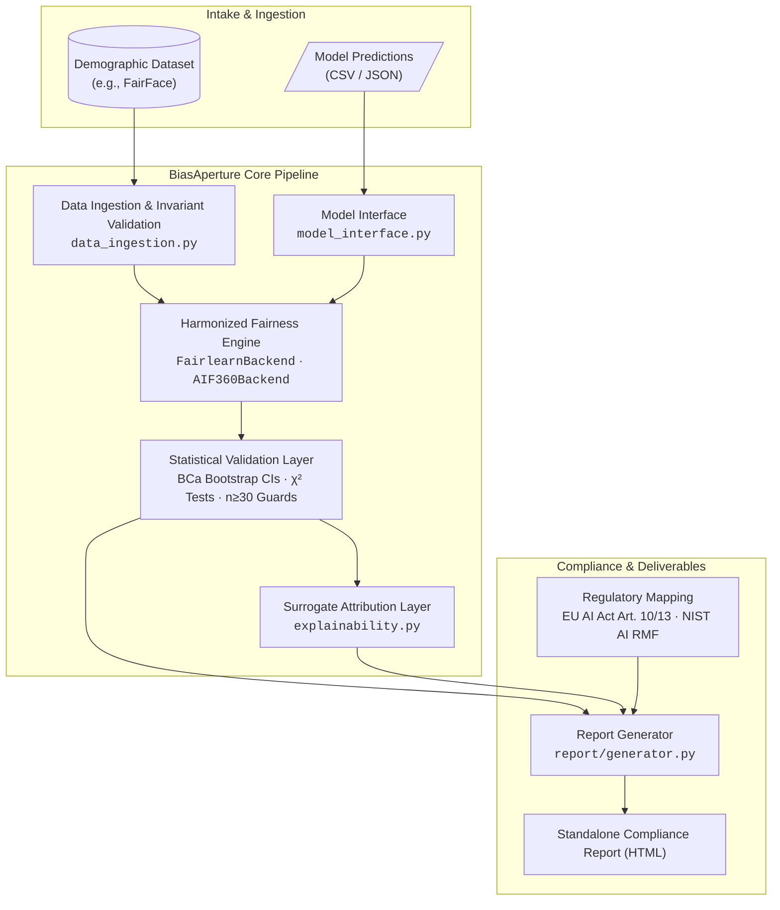

# BiasAperture

### A Diagnostic Framework for Demographic Bias Auditing in Facial Analysis Systems

BiasAperture is a modular diagnostic software framework designed to audit computer vision models for demographic disparities across race, gender, age, and intersectional subgroups. Developed as a capstone project for the **Fusemachines AI Fellowship Program** (Kathmandu, Nepal), the framework provides an end-to-end, black-box evaluation pipeline that transforms model predictions and demographic metadata into rigorous, regulator-ready compliance reports.

**Authors:** Aaradhya Dev Tamrakar, Tisha Manandhar  
**Supervisor:** Shreejan Kisee, Teaching Assistant, Fusemachines AI Fellowship  
**License:** MIT  

---

## Overview

Facial analysis systems deployed in commercial and public domains frequently exhibit significant performance disparities across demographic cohorts. Auditing these models requires more than calculating aggregate accuracy; it demands standardized demographic data ingestion, mathematically consistent disparity metrics, statistical significance testing, and interpretable documentation.

BiasAperture addresses these challenges through a non-invasive, diagnostic pipeline:

- **Dual-Backend Verification**: Evaluates foundational fairness metrics across two independent libraries—**Fairlearn** and **AIF360**—reconciling differences in sign conventions, boundary handling, and multi-class formulations to eliminate single-library implementation bias.
- **Statistical Inference & Safeguards**: Couples every disparity metric with a 95% BCa Bootstrap Confidence Interval ($B \ge 1,000$), Pearson's $\chi^2$ test of independence (with Fisher's exact test fallback for sparse contingency tables), and automated suppression guards for underrepresented cohorts ($n < 30$).
- **Surrogate Attribution**: Pinpoints key demographic attributes and potential proxy features that contribute to statistically flagged performance gaps.
- **Offline Compliance Reporting**: Compiles comprehensive, standalone HTML audit reports with inline vector visualizations and metadata cards, fully compatible with air-gapped evaluation environments.
- **Regulatory Traceability**: Maps all evaluation metrics and data governance checks directly to international standards, including **Articles 10 and 13 of the EU AI Act** and **NIST AI RMF 1.0 (Measure 2.11)**.

---

## Core Principles & Scope

1. **Strictly Diagnostic & Evaluative**: BiasAperture is engineered purely for auditing, benchmarking, and reporting. It operates externally on datasets and prediction outputs without modifying model weights, performing in-processing debiasing, or generating synthetic data.
2. **Statistical Integrity**: To prevent unreliable claims on small sample sizes, subgroups with fewer than 30 samples are marked with `insufficient_sample=True` and have their computed values suppressed in compliance outputs.
3. **Reproducibility & Offline Portability**: The full pipeline—from dataset profiling to report compilation—executes locally without external network dependencies or remote CDN scripts.

---

## System Architecture


```mermaid
flowchart TD
    subgraph INTAKE["Intake & Ingestion"]
        D1[("Demographic Dataset<br/>(e.g., FairFace)")]
        P1[/"Model Predictions<br/>(CSV / JSON)"/]
    end

    subgraph CORE["BiasAperture Core Pipeline"]
        ING["Data Ingestion & Invariant Validation<br/><code>data_ingestion.py</code>"]
        MIF["Model Interface<br/><code>model_interface.py</code>"]
        ENG["Harmonized Fairness Engine<br/><code>FairlearnBackend</code> · <code>AIF360Backend</code>"]
        STAT["Statistical Validation Layer<br/>BCa Bootstrap CIs · χ² Tests · n≥30 Guards"]
        EXP["Surrogate Attribution Layer<br/><code>explainability.py</code>"]
    end

    subgraph OUTPUT["Compliance & Deliverables"]
        REP["Report Generator<br/><code>report/generator.py</code>"]
        HTML["Standalone Compliance Report (HTML)"]
        REG["Regulatory Mapping<br/>EU AI Act Art. 10/13 · NIST AI RMF"]
    end

    D1 --> ING
    P1 --> MIF
    ING --> ENG
    MIF --> ENG
    ENG --> STAT
    STAT --> EXP
    STAT --> REP
    EXP --> REP
    REG --> REP
    REP --> HTML
```

### Module Breakdown

| Module | Location | Primary Responsibility |
| :--- | :--- | :--- |
| **Schema & Contracts** | `src/bias_aperture/schema.py` | Locked data models, demographic taxonomies, and metric container definitions. |
| **Data Ingestion** | `src/bias_aperture/data_ingestion.py` | Column alias mapping, demographic validation, missing value handling, and cohort support profiling. |
| **Model Interface** | `src/bias_aperture/model_interface.py` | Prediction ingestion contracts supporting batch CSV/JSON formats and extensible model abstractions. |
| **Fairness Metrics** | `src/bias_aperture/fairness/` | Dual-backend strategy pattern cross-validating Core Four metrics with One-vs-Rest multi-class decomposition. |
| **Statistical Analysis** | `src/bias_aperture/fairness/statistics.py` | BCa bootstrap confidence intervals, chi-square and Fisher's exact tests, and backend divergence checks. |
| **Explainability** | `src/bias_aperture/explainability.py` | Surrogate feature attribution on statistically flagged disparities to identify influential demographic axes. |
| **Report Generation** | `src/bias_aperture/report/` | Offline Jinja2 HTML report generator embedding interactive CSS, vector charts, and regulatory matrices. |
| **CLI Orchestration** | `src/bias_aperture/cli.py` | Command-line interface coordinating end-to-end audit runs and configuration. |

---

## Supported Fairness Metrics & Regulatory Standards

BiasAperture focuses on four foundational disparity metrics, evaluating both marginal demographic axes and compound intersectional groups:

| Metric | Target Measurement | Evaluation Logic | Regulatory Reference |
| :--- | :--- | :--- | :--- |
| **Demographic Parity Difference (DPD)** | Selection rate parity | Difference in selection rates between highest and lowest recipient groups. | EU AI Act Art. 10(2)(f) |
| **Disparate Impact Ratio (DIR)** | Relative selection rate | Ratio of selection rates (evaluates compliance against the 80% / four-fifths rule). | US EEOC / NIST AI RMF 2.11 |
| **Equal Opportunity Difference (EOP)** | True Positive Rate parity | Maximum absolute difference in TPR across demographic subgroups. | EU AI Act Art. 10(2)(f) |
| **Equalized Odds Difference (EOD)** | Comprehensive error parity | Maximum of TPR difference and FPR difference across demographic subgroups. | NIST AI RMF Measure 2.11 |

---

## Installation & Setup

BiasAperture uses [`uv`](https://github.com/astral-sh/uv) for fast, reproducible dependency management.

### 1. Clone Repository & Install Dependencies

```bash
# Clone the repository
git clone https://github.com/fuseai-fellowship/BiasAperture-A-Diagnostic-Framework-for-Demographic-Bias-Auditing-in-Facial-Analysis-Models.git
cd BiasAperture-A-Diagnostic-Framework-for-Demographic-Bias-Auditing-in-Facial-Analysis-Models

# Synchronize virtual environment and dependencies
uv sync --extra dev
```

### 2. Run Quality Checks & Test Suite

```bash
# Run pytest test suite
uv run --extra dev pytest

# Check formatting and linting
uv run --extra dev ruff check src/
uv run --extra dev ruff format --check src/
```

---

## Usage Guide

The framework is driven by the `bias-aperture` command-line utility.

### Running a Single-Axis Bias Audit

Audit model predictions across a single demographic axis (e.g., race) with dual-backend validation and 1,000 bootstrap resamples:

```bash
uv run bias-aperture audit \
  -i data/processed/fairface_predictions_val.csv \
  -a race \
  --true-label-col true_gender \
  --predicted-label-col predicted_gender \
  --race-col subgroup_race \
  --gender-col subgroup_gender \
  --age-col subgroup_age \
  -o report/audit_val_race.html \
  --backend dual \
  --bca-resamples 1000
```

### Running an Intersectional Bias Audit

Audit compound demographic intersections (e.g., race $\times$ gender) to uncover compounding bias patterns:

```bash
uv run bias-aperture audit \
  -i data/processed/fairface_predictions_val.csv \
  -a race_gender \
  --true-label-col true_gender \
  --predicted-label-col predicted_gender \
  --race-col subgroup_race \
  --gender-col subgroup_gender \
  --age-col subgroup_age \
  -o report/audit_val_race_gender.html \
  --backend dual \
  --bca-resamples 1000
```

### Reviewing the Audit Report

Open the generated HTML report in any browser to inspect:
- Subgroup contingency and representation profiles
- Core Four disparity measurements with dual-backend cross-checks
- 95% BCa bootstrap confidence interval error bars
- Asymptotic $\chi^2$ independence test results and $p$-values
- Article-by-article compliance mapping against the EU AI Act and NIST AI RMF

---

## Repository Layout

```
BiasAperture/
├── data/                       # Dataset schemas, alignment notes, and test predictions
│   ├── README.md               # Dataset sourcing and preprocessing instructions
│   └── processed/              # Validation prediction datasets
├── docs/                       # Project documentation, specifications, and literature reviews
│   ├── literature-review-matrix.md # Survey of 20 foundational fairness and CV papers
│   ├── DATA_GOVERNANCE.md      # Data governance and ethics protocol
│   ├── schema-lock-m1.md       # Canonical schema definition
│   └── PROPOSAL_DEFENSE_MASTER_DOSSIER.md # Comprehensive defense and evaluation dossier
├── presentation/               # Proposal defense slide deck (LaTeX Beamer)
│   ├── main.tex                # 18-slide Beamer presentation source
│   ├── main.pdf                # Compiled slide deck
│   └── speaker_notes.md        # Presentation script and defense talking points
├── report/                     # Academic proposal report & generated audit artifacts
│   ├── main.tex                # Academic proposal document source
│   ├── main.pdf                # Compiled LaTeX proposal document
│   ├── references.bib          # BibTeX academic citations
│   └── *.html                  # Generated compliance audit reports
├── scripts/                    # Exploratory analysis and verification scripts
├── specs/                      # Technical specification documents (00 through 11)
├── src/                        # Implementation source code
│   ├── bias_aperture/          # Core framework package
│   │   ├── cli.py              # CLI entry point
│   │   ├── data_ingestion.py   # Data validation and profiling
│   │   ├── explainability.py   # Surrogate feature attribution
│   │   ├── model_interface.py  # Model prediction ingestion
│   │   ├── schema.py           # Core schemas and data containers
│   │   ├── fairness/           # Dual-backend disparity engine & statistics
│   │   └── report/             # Offline HTML compliance report generator
│   └── tests/                  # Pytest verification test suite
├── pyproject.toml              # Package definition and dependencies
├── uv.lock                     # Deterministic dependency lockfile
└── LICENSE                     # MIT License
```

---

## Research & Benchmark Dataset

BiasAperture benchmarks demographic fairness on the **FairFace** dataset (Kärkkäinen & Joo, 2021), comprising 97,698 balanced facial images across 7 race categories, 2 gender categories, and 9 age intervals. Detailed dataset download instructions and column alignment mappings are provided in [`data/README.md`](data/README.md).

---

## Project Documentation & Academic Artifacts

- **Academic Report**: Comprehensive proposal report in [`report/main.pdf`](report/main.pdf)
- **Defense Slide Deck**: 18-slide LaTeX Beamer deck in [`presentation/main.pdf`](presentation/main.pdf) with accompanying [speaker notes](presentation/speaker_notes.md)
- **Literature Review Matrix**: Structured survey of 20 academic papers in [`docs/literature-review-matrix.md`](docs/literature-review-matrix.md)
- **Technical Specifications**: Modular architectural specs in [`specs/`](specs/)
- **Data Governance Policy**: Ethics and licensing protocol in [`docs/DATA_GOVERNANCE.md`](docs/DATA_GOVERNANCE.md)
- **Research Knowledge Bases**: Google NotebookLM & Gemini workspaces catalogued in [`docs/NOTEBOOKS.md`](docs/NOTEBOOKS.md)

---

## License

This project is licensed under the **MIT License** — see the [LICENSE](LICENSE) file for details.
