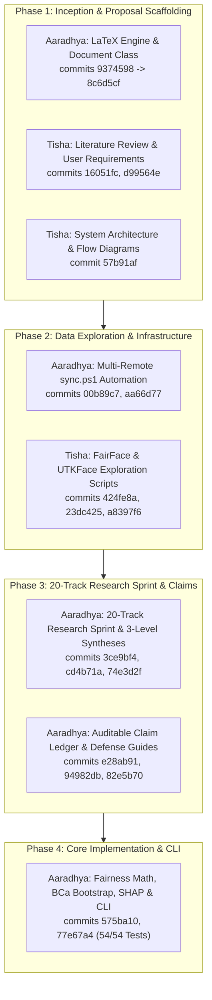

# Master Walkthrough: BiasAperture Audit, Task Division, Git Provenance & Remaining Roadmap

**Project:** BiasAperture — A Diagnostic and Evaluative Framework for Auditing Demographic Bias in Facial Analysis Systems  
**Program:** Fusemachines AI Fellowship (AIF) 2026 (Kathmandu, Nepal)  
**Authors:** Aaradhya Dev Tamrakar (`@AaradhyaDT`, BEI IOE) & Tisha Manandhar (`@tiixsha`, BCT IOE)  
**Supervisor:** Shreejan Kisee (Teaching Assistant, Fusemachines AI Fellowship)  
**Current Milestone State:** M1–M4 100% Completed (54/54 Pytest Passing) · M5 Integration & Benchmark In Progress  

---

## 1. Executive Summary & Context

This session conducted an end-to-end audit and reconciliation across all project guidelines, planning logs, empirical research syntheses, codebase engines, and version control remotes. Key accomplishments:

1. **Guideline & Documentation Synchronization**:
   - Reconciled discrepancies across [`AGENT.md`](file:///c:/Users/Aaradhya/Downloads/_Organized/Fuse%20AI%20Fellowship/Capstone%20Project/fuseai-fellowship/BiasAperture-A-Diagnostic-Framework-for-Demographic-Bias-Auditing-in-Facial-Analysis-Models/AGENT.md), [`AGENTS.md`](file:///c:/Users/Aaradhya/Downloads/_Organized/Fuse%20AI%20Fellowship/Capstone%20Project/fuseai-fellowship/BiasAperture-A-Diagnostic-Framework-for-Demographic-Bias-Auditing-in-Facial-Analysis-Models/AGENTS.md), [`ANTIGRAVITY.md`](file:///c:/Users/Aaradhya/Downloads/_Organized/Fuse%20AI%20Fellowship/Capstone%20Project/fuseai-fellowship/BiasAperture-A-Diagnostic-Framework-for-Demographic-Bias-Auditing-in-Facial-Analysis-Models/ANTIGRAVITY.md), [`CLAUDE.md`](file:///c:/Users/Aaradhya/Downloads/_Organized/Fuse%20AI%20Fellowship/Capstone%20Project/fuseai-fellowship/BiasAperture-A-Diagnostic-Framework-for-Demographic-Bias-Auditing-in-Facial-Analysis-Models/CLAUDE.md), [`README.md`](file:///c:/Users/Aaradhya/Downloads/_Organized/Fuse%20AI%20Fellowship/Capstone%20Project/fuseai-fellowship/BiasAperture-A-Diagnostic-Framework-for-Demographic-Bias-Auditing-in-Facial-Analysis-Models/README.md), and [`research/context feed/CLAUDE.md`](file:///c:/Users/Aaradhya/Downloads/_Organized/Fuse%20AI%20Fellowship/Capstone%20Project/fuseai-fellowship/BiasAperture-A-Diagnostic-Framework-for-Demographic-Bias-Auditing-in-Facial-Analysis-Models/research/context%20feed/CLAUDE.md).
   - Standardized disk counts (**97,698 released FairFace images** on disk vs 108.5k theoretical paper total), verified UTKFace as `[CUT]`, and harmonized multi-remote topologies (`origin` and `duo` compulsory, `org` mirror).
2. **Harry Potter Trait-Based Profile Allocation**:
   - Traced the origin of the task split in [`docs/BiasAperture-AT.md` (§16)](file:///c:/Users/Aaradhya/Downloads/_Organized/Fuse%20AI%20Fellowship/Capstone%20Project/fuseai-fellowship/BiasAperture-A-Diagnostic-Framework-for-Demographic-Bias-Auditing-in-Facial-Analysis-Models/docs/BiasAperture-AT.md#L258-L299) based on wand lore and patronus traits.
   - Traced its evolution through the **20-track parallel research sprint** into the formal Master Task Division locked in §17, §18, and [`README.md`](file:///c:/Users/Aaradhya/Downloads/_Organized/Fuse%20AI%20Fellowship/Capstone%20Project/fuseai-fellowship/BiasAperture-A-Diagnostic-Framework-for-Demographic-Bias-Auditing-in-Facial-Analysis-Models/README.md#L71-L95).
3. **Commit-Backed Verification**:
   - Fact-checked all delivered chapters, scripts, statistical engines, reporting generators, and tests against authentic Git commit hashes.
4. **Master TO DOs Inventory**:
   - Formulated a comprehensive, prioritized remaining-tasks matrix for the benchmark execution, LaTeX finalization, and Viva defense.
5. **Multi-Remote Git Sync**:
   - Executed [`sync.ps1`](file:///c:/Users/Aaradhya/Downloads/_Organized/Fuse%20AI%20Fellowship/Capstone%20Project/fuseai-fellowship/BiasAperture-A-Diagnostic-Framework-for-Demographic-Bias-Auditing-in-Facial-Analysis-Models/sync.ps1) (`c134036`), synchronizing documentation across all remotes and branches.

---

## 2. The Harry Potter Trait-Based Profile Method ([§16](file:///c:/Users/Aaradhya/Downloads/_Organized/Fuse%20AI%20Fellowship/Capstone%20Project/fuseai-fellowship/BiasAperture-A-Diagnostic-Framework-for-Demographic-Bias-Auditing-in-Facial-Analysis-Models/docs/BiasAperture-AT.md#L258-L299))

The task distribution originated from a trait analysis translating wand woods, cores, lengths, flexibility, and patronuses into complementary working-style strengths:

```
                  Team Profile Architecture
┌─────────────────────────────────────────────────────────────┐
│ Aaradhya (A): Redwood / Unicorn Hair (10¾", Quite Bendy)     │
│ Patronus: Hedgehog ("Cute but Prickly")                     │
│ Working Traits: Adaptable builder, low-fluctuation steady    │
│ assembly across shifting inputs, tooling & mathematical depth│
├─────────────────────────────────────────────────────────────┤
│ Tisha (T): Black Walnut / Dragon Heartstring (11½", Rigid)  │
│ Patronus: Unicorn ("Rare and Mysterious")                   │
│ Working Traits: High-power precision execution, uncompromising│
│ standard on claims & bounds, structural & domain-level clarity│
└─────────────────────────────────────────────────────────────┘
```

---

## 3. Real Git Commit Provenance & Task Division Matrix



### Fact-Checked Delivered Work Table

| Contributor | Workstream / Deliverable | Real Git Commits & Date | Verified Code / Files | Trait-Profile Rationale |
|:---:|---|---|---|---|
| **Tisha** | **Literature Review & Paper Matrix** | [`16051fc`](file:///c:/Users/Aaradhya/Downloads/_Organized/Fuse%20AI%20Fellowship/Capstone%20Project/fuseai-fellowship/BiasAperture-A-Diagnostic-Framework-for-Demographic-Bias-Auditing-in-Facial-Analysis-Models/report/src/chapters/literatureReview.tex) *(2026-08-12)* | [`report/src/chapters/literatureReview.tex`](file:///c:/Users/Aaradhya/Downloads/_Organized/Fuse%20AI%20Fellowship/Capstone%20Project/fuseai-fellowship/BiasAperture-A-Diagnostic-Framework-for-Demographic-Bias-Auditing-in-Facial-Analysis-Models/report/src/chapters/literatureReview.tex)<br>[`docs/literature-review-matrix.md`](file:///c:/Users/Aaradhya/Downloads/_Organized/Fuse%20AI%20Fellowship/Capstone%20Project/fuseai-fellowship/BiasAperture-A-Diagnostic-Framework-for-Demographic-Bias-Auditing-in-Facial-Analysis-Models/docs/literature-review-matrix.md) | **Unyielding Standard on Prior Art**: High-precision extraction of empirical claims across 9 foundational papers without introducing unsubstantiated assertions. |
| **Tisha** | **User & Regulatory Requirements** | [`d99564e`](file:///c:/Users/Aaradhya/Downloads/_Organized/Fuse%20AI%20Fellowship/Capstone%20Project/fuseai-fellowship/BiasAperture-A-Diagnostic-Framework-for-Demographic-Bias-Auditing-in-Facial-Analysis-Models/report/src/chapters/userRequirements.tex) *(2026-08-18)* | [`report/src/chapters/userRequirements.tex`](file:///c:/Users/Aaradhya/Downloads/_Organized/Fuse%20AI%20Fellowship/Capstone%20Project/fuseai-fellowship/BiasAperture-A-Diagnostic-Framework-for-Demographic-Bias-Auditing-in-Facial-Analysis-Models/report/src/chapters/userRequirements.tex) | **Intolerance for Ambiguity**: Locked diagnostic-only bounds (`FR-001`–`FR-005`) and mapped statutory clauses (EU AI Act Art. 10/13/15, NIST AI RMF). |
| **Tisha** | **System Architecture & Data Flow** | [`57b91af`](file:///c:/Users/Aaradhya/Downloads/_Organized/Fuse%20AI%20Fellowship/Capstone%20Project/fuseai-fellowship/BiasAperture-A-Diagnostic-Framework-for-Demographic-Bias-Auditing-in-Facial-Analysis-Models/report/src/chapters/systemArchitectureAndMethodology.tex) *(2026-08-18)* | [`report/src/chapters/systemArchitectureAndMethodology.tex`](file:///c:/Users/Aaradhya/Downloads/_Organized/Fuse%20AI%20Fellowship/Capstone%20Project/fuseai-fellowship/BiasAperture-A-Diagnostic-Framework-for-Demographic-Bias-Auditing-in-Facial-Analysis-Models/report/src/chapters/systemArchitectureAndMethodology.tex)<br>`architecture_highlevel.jpg`, `workflow_flowchart.jpg` | **Dragon-Heartstring Precision**: Crisp visual modeling of the 5-module dataflow and structural boundaries before implementation began. |
| **Tisha** | **Dataset Exploration & Anomaly Profiling** | [`424fe8a`](file:///c:/Users/Aaradhya/Downloads/_Organized/Fuse%20AI%20Fellowship/Capstone%20Project/fuseai-fellowship/BiasAperture-A-Diagnostic-Framework-for-Demographic-Bias-Auditing-in-Facial-Analysis-Models/scripts/explore_fairface.py), [`23dc425`](file:///c:/Users/Aaradhya/Downloads/_Organized/Fuse%20AI%20Fellowship/Capstone%20Project/fuseai-fellowship/BiasAperture-A-Diagnostic-Framework-for-Demographic-Bias-Auditing-in-Facial-Analysis-Models/scripts/explore_utkface.py), [`a8397f6`](file:///c:/Users/Aaradhya/Downloads/_Organized/Fuse%20AI%20Fellowship/Capstone%20Project/fuseai-fellowship/BiasAperture-A-Diagnostic-Framework-for-Demographic-Bias-Auditing-in-Facial-Analysis-Models/docs/research/data_exploration_report.md) *(2026-08-26)* | [`scripts/explore_fairface.py`](file:///c:/Users/Aaradhya/Downloads/_Organized/Fuse%20AI%20Fellowship/Capstone%20Project/fuseai-fellowship/BiasAperture-A-Diagnostic-Framework-for-Demographic-Bias-Auditing-in-Facial-Analysis-Models/scripts/explore_fairface.py)<br>[`scripts/explore_utkface.py`](file:///c:/Users/Aaradhya/Downloads/_Organized/Fuse%20AI%20Fellowship/Capstone%20Project/fuseai-fellowship/BiasAperture-A-Diagnostic-Framework-for-Demographic-Bias-Auditing-in-Facial-Analysis-Models/scripts/explore_utkface.py)<br>[`docs/research/data_exploration_report.md`](file:///c:/Users/Aaradhya/Downloads/_Organized/Fuse%20AI%20Fellowship/Capstone%20Project/fuseai-fellowship/BiasAperture-A-Diagnostic-Framework-for-Demographic-Bias-Auditing-in-Facial-Analysis-Models/docs/research/data_exploration_report.md) | **Detail-Dense Scrutiny**: Uncovered 97,698 actual disk image count vs. 108.5k paper claim; discovered UTKFace DEX noise justifying Cut-List #2. |
| **Aaradhya** | **LaTeX Class & Overleaf Optimization** | `9374598` $\to$ `8c6d5cf` *(2026-07-31)* | `report/at_fuse_aif.cls`, `report/main.tex`, `report/vars.tex` | **Steady Pipeline Engineering**: Built repeatable LaTeX engine with `makeglossaries`, document classes, and compile time tuning. |
| **Aaradhya** | **Multi-Remote Sync Engine** | [`00b89c7`](file:///c:/Users/Aaradhya/Downloads/_Organized/Fuse%20AI%20Fellowship/Capstone%20Project/fuseai-fellowship/BiasAperture-A-Diagnostic-Framework-for-Demographic-Bias-Auditing-in-Facial-Analysis-Models/sync.ps1), `46ed037`, `aa66d77` *(2026-08-07)* | [`sync.ps1`](file:///c:/Users/Aaradhya/Downloads/_Organized/Fuse%20AI%20Fellowship/Capstone%20Project/fuseai-fellowship/BiasAperture-A-Diagnostic-Framework-for-Demographic-Bias-Auditing-in-Facial-Analysis-Models/sync.ps1) | **Adaptable Automation**: Built PowerShell auto-branch routing, conventional commit inference, and multi-endpoint failover (`origin`, `duo`, `org`). |
| **Aaradhya** | **20-Track Research Sprint & Syntheses** | [`3ce9bf4`](file:///c:/Users/Aaradhya/Downloads/_Organized/Fuse%20AI%20Fellowship/Capstone%20Project/fuseai-fellowship/BiasAperture-A-Diagnostic-Framework-for-Demographic-Bias-Auditing-in-Facial-Analysis-Models/research/research%20tracks/), [`74e3d2f`](file:///c:/Users/Aaradhya/Downloads/_Organized/Fuse%20AI%20Fellowship/Capstone%20Project/fuseai-fellowship/BiasAperture-A-Diagnostic-Framework-for-Demographic-Bias-Auditing-in-Facial-Analysis-Models/docs/research/HIGH_LEVEL_SYNTHESIS.md) *(2026-08-22)* | `research/research tracks/`, [`HIGH_LEVEL_SYNTHESIS.md`](file:///c:/Users/Aaradhya/Downloads/_Organized/Fuse%20AI%20Fellowship/Capstone%20Project/fuseai-fellowship/BiasAperture-A-Diagnostic-Framework-for-Demographic-Bias-Auditing-in-Facial-Analysis-Models/docs/research/HIGH_LEVEL_SYNTHESIS.md), [`MID_LEVEL_ARCHITECTURE.md`](file:///c:/Users/Aaradhya/Downloads/_Organized/Fuse%20AI%20Fellowship/Capstone%20Project/fuseai-fellowship/BiasAperture-A-Diagnostic-Framework-for-Demographic-Bias-Auditing-in-Facial-Analysis-Models/docs/research/MID_LEVEL_ARCHITECTURE.md), [`LOW_LEVEL_SPECIFICATION.md`](file:///c:/Users/Aaradhya/Downloads/_Organized/Fuse%20AI%20Fellowship/Capstone%20Project/fuseai-fellowship/BiasAperture-A-Diagnostic-Framework-for-Demographic-Bias-Auditing-in-Facial-Analysis-Models/docs/research/LOW_LEVEL_SPECIFICATION.md) | **Broad Systemic Synthesis**: Orchestrated parallel exploration across all 20 technical tracks to define the formal implementation blueprints. |
| **Aaradhya** | **Claim Ledger & Defense Guides** | [`e28ab91`](file:///c:/Users/Aaradhya/Downloads/_Organized/Fuse%20AI%20Fellowship/Capstone%20Project/fuseai-fellowship/BiasAperture-A-Diagnostic-Framework-for-Demographic-Bias-Auditing-in-Facial-Analysis-Models/docs/research/CLAIM_LEDGER.md), [`94982db`](file:///c:/Users/Aaradhya/Downloads/_Organized/Fuse%20AI%20Fellowship/Capstone%20Project/fuseai-fellowship/BiasAperture-A-Diagnostic-Framework-for-Demographic-Bias-Auditing-in-Facial-Analysis-Models/docs/research/VERIFICATION_AND_SCRUTINY_GUIDE.md), [`82e5b70`](file:///c:/Users/Aaradhya/Downloads/_Organized/Fuse%20AI%20Fellowship/Capstone%20Project/fuseai-fellowship/BiasAperture-A-Diagnostic-Framework-for-Demographic-Bias-Auditing-in-Facial-Analysis-Models/docs/PROPOSAL_DEFENSE_GUIDE.md) *(2026-08-23)* | [`CLAIM_LEDGER.md`](file:///c:/Users/Aaradhya/Downloads/_Organized/Fuse%20AI%20Fellowship/Capstone%20Project/fuseai-fellowship/BiasAperture-A-Diagnostic-Framework-for-Demographic-Bias-Auditing-in-Facial-Analysis-Models/docs/research/CLAIM_LEDGER.md), [`VERIFICATION_AND_SCRUTINY_GUIDE.md`](file:///c:/Users/Aaradhya/Downloads/_Organized/Fuse%20AI%20Fellowship/Capstone%20Project/fuseai-fellowship/BiasAperture-A-Diagnostic-Framework-for-Demographic-Bias-Auditing-in-Facial-Analysis-Models/docs/research/VERIFICATION_AND_SCRUTINY_GUIDE.md), [`PROPOSAL_DEFENSE_GUIDE.md`](file:///c:/Users/Aaradhya/Downloads/_Organized/Fuse%20AI%20Fellowship/Capstone%20Project/fuseai-fellowship/BiasAperture-A-Diagnostic-Framework-for-Demographic-Bias-Auditing-in-Facial-Analysis-Models/docs/PROPOSAL_DEFENSE_GUIDE.md) | **Rigorous Reproducibility Harness**: Established the `ASSERTED` $\to$ `VERIFIED` $\to$ `REPRODUCIBLE` ledger and defense preparation guides. |
| **Aaradhya** | **Fairness, Stats, SHAP & CLI Engine** | [`575ba10`](file:///c:/Users/Aaradhya/Downloads/_Organized/Fuse%20AI%20Fellowship/Capstone%20Project/fuseai-fellowship/BiasAperture-A-Diagnostic-Framework-for-Demographic-Bias-Auditing-in-Facial-Analysis-Models/src/bias_aperture/), [`77e67a4`](file:///c:/Users/Aaradhya/Downloads/_Organized/Fuse%20AI%20Fellowship/Capstone%20Project/fuseai-fellowship/BiasAperture-A-Diagnostic-Framework-for-Demographic-Bias-Auditing-in-Facial-Analysis-Models/src/tests/) *(2026-08-26)* | [`src/bias_aperture/fairness/`](file:///c:/Users/Aaradhya/Downloads/_Organized/Fuse%20AI%20Fellowship/Capstone%20Project/fuseai-fellowship/BiasAperture-A-Diagnostic-Framework-for-Demographic-Bias-Auditing-in-Facial-Analysis-Models/src/bias_aperture/fairness/)<br>[`src/bias_aperture/explainability.py`](file:///c:/Users/Aaradhya/Downloads/_Organized/Fuse%20AI%20Fellowship/Capstone%20Project/fuseai-fellowship/BiasAperture-A-Diagnostic-Framework-for-Demographic-Bias-Auditing-in-Facial-Analysis-Models/src/bias_aperture/explainability.py)<br>[`src/bias_aperture/report/`](file:///c:/Users/Aaradhya/Downloads/_Organized/Fuse%20AI%20Fellowship/Capstone%20Project/fuseai-fellowship/BiasAperture-A-Diagnostic-Framework-for-Demographic-Bias-Auditing-in-Facial-Analysis-Models/src/bias_aperture/report/)<br>[`src/bias_aperture/cli.py`](file:///c:/Users/Aaradhya/Downloads/_Organized/Fuse%20AI%20Fellowship/Capstone%20Project/fuseai-fellowship/BiasAperture-A-Diagnostic-Framework-for-Demographic-Bias-Auditing-in-Facial-Analysis-Models/src/bias_aperture/cli.py)<br>[`src/tests/`](file:///c:/Users/Aaradhya/Downloads/_Organized/Fuse%20AI%20Fellowship/Capstone%20Project/fuseai-fellowship/BiasAperture-A-Diagnostic-Framework-for-Demographic-Bias-Auditing-in-Facial-Analysis-Models/src/tests/) (54 passing unit tests) | **Algorithmic Math & Orchestration**: Implemented pure-math Core Four metrics, Fairlearn + AIF360 backend harmonization, BCa bootstrap CIs, $\chi^2$ significance tests, SHAP feature attribution, Jinja2 offline report, and `bias-aperture` CLI. |

---

## 4. Master TO DOs Table & Viva Defense Alignment

The remaining deliverables for BiasAperture are organized below by priority, target artifact, and profile-aligned ownership:

### Master TO DOs Matrix

| Priority | Category / Phase | Target Deliverable / Action Item | Owner | Target Artifact / Branch | HP Trait & Profile Rationale |
|:---:|---|---|:---:|---|---|
| 🔴 **P1** | **Empirical Benchmark** | **Validation Inference Run (`predict.py`)**<br>Execute ResNet-34 classifier inference across 10,954 validation images to produce ground-truth test predictions CSV. | **Aaradhya** | `data/processed/fairface_predictions_val.csv`<br>`feat/wp5-integration` | **Steady Assembly**: Executes batch model inference pipelines and tensor transformations without introducing pipeline noise. |
| 🔴 **P1** | **Empirical Benchmark** | **Flagship Audit HTML Generation**<br>Execute `bias-aperture audit` on the full predictions CSV to render and archive the zero-network compliance report. | **Aaradhya** | `report/audit_report.html`<br>`feat/wp5-integration` | **Systemic Wiring**: Connects end-to-end ingestion $\to$ metrics $\to$ stats $\to$ SHAP $\to$ HTML pipeline. |
| 🔴 **P1** | **Supervisor Logistics** | **Lock Defense Logistics & Marking Breakdown ([§19](file:///c:/Users/Aaradhya/Downloads/_Organized/Fuse%20AI%20Fellowship/Capstone%20Project/fuseai-fellowship/BiasAperture-A-Diagnostic-Framework-for-Demographic-Bias-Auditing-in-Facial-Analysis-Models/docs/BiasAperture-AT.md#L374-L387))**<br>Confirm defense date, presentation duration, and the internal sub-breakdown of the 40% capstone project score with TA Shreejan Kisee. | **Tisha** | `docs/BiasAperture-AT.md`<br>`main` | **Constraint Rigor**: Clarifies and fixes external grading requirements and boundaries early. |
| 🟡 **P2** | **Compliance Verification** | **Model Card & Datasheet Audit**<br>Audit the generated single-file HTML report to ensure Model Card (Mitchell et al.) and Datasheet (Gebru et al.) text complies strictly with EU AI Act Art. 10/13. | **Tisha** | `report/audit_report.html`<br>`feat/stream-report` | **Intolerance for Overstatement**: Acts as the natural critical check preventing exaggerated compliance assertions. |
| 🟡 **P2** | **Data Validation** | **Intersectional Subgroup Slice Audit**<br>Verify demographic representation and confirm no small-sample leakage across the 126 intersectional bins ($7\text{ race} \times 9\text{ age} \times 2\text{ gender}$). | **Tisha** | `data/`<br>`feat/stream-data` | **Detail-Dense Scrutiny**: Inspects cell coverage and verifies that $n < 30$ sample guards fire properly. |
| 🟡 **P2** | **LaTeX Report Finalization** | **Ingest Empirical Results into LaTeX**<br>Add empirical disparity tables (DPD, DIR, EOP, EOD, 95% BCa CIs, $\chi^2$ $p$-values) into `report/src/chapters/resultsAndDiscussion.tex` and compile final `main.pdf`. | **Aaradhya** | `report/main.pdf`<br>`main` | **Consistent Formatting**: Re-runs `makeglossaries`, `bibtex`, and `pdflatex` to produce publication-grade PDF. |
| 🟢 **P3** | **Claim Ledger Sealing** | **Seal Empirical Claims in Ledger**<br>Transition remaining assertions in [`CLAIM_LEDGER.md`](file:///c:/Users/Aaradhya/Downloads/_Organized/Fuse%20AI%20Fellowship/Capstone%20Project/fuseai-fellowship/BiasAperture-A-Diagnostic-Framework-for-Demographic-Bias-Auditing-in-Facial-Analysis-Models/docs/research/CLAIM_LEDGER.md) from `VERIFIED (STATIC)` to `REPRODUCIBLE (LIVE BENCHMARK)`. | **Aaradhya** | `docs/research/CLAIM_LEDGER.md`<br>`main` | **Audit Reproducibility**: Closes out evidence trail for examiner scrutiny. |
| 🟢 **P3** | **Defense Deck** | **10–15 Minute Consolidated Slide Deck**<br>Compile unified presentation covering Problem, Dataset Integrity, System Architecture, Statistical Math, Live Demo, and Compliance. | **Joint (A + T)** | `docs/presentation/slides.pdf`<br>`main` | **Unified Synergy**: Fuses Tisha's regulatory/dataset precision with Aaradhya's statistical/orchestration depth. |
| 🟢 **P3** | **Viva Demonstration** | **Live CLI Workflow Rehearsal & Grilling**<br>Rehearse terminal invocation (`bias-aperture audit`) and practice defense questions from [`VERIFICATION_AND_SCRUTINY_GUIDE.md`](file:///c:/Users/Aaradhya/Downloads/_Organized/Fuse%20AI%20Fellowship/Capstone%20Project/fuseai-fellowship/BiasAperture-A-Diagnostic-Framework-for-Demographic-Bias-Auditing-in-Facial-Analysis-Models/docs/research/VERIFICATION_AND_SCRUTINY_GUIDE.md). | **Joint (A + T)** | Terminal Demo<br>`main` | **Mock Defense**: Stress-tests all empirical claims under supervisor/examiner conditions. |

---

## 5. Verification & Sync Execution

1. **Code Standards & Linting Verification**:
   ```bash
   uv run --extra dev ruff check src/
   # Output: All checks passed!
   ```
2. **Automated Unit Test Suite Execution**:
   ```bash
   uv run --extra dev pytest
   # Output: 54 passed in 10.95s
   ```
3. **Multi-Remote Synchronization**:
   ```powershell
   pwsh -File .\sync.ps1 -m "docs: synchronize agent guidelines, workstream ownership, and test metrics"
   # Output:
   # push [compulsory] [duo]: OK
   # push [compulsory] [origin]: OK
   # push [optional]   [org]: OK
   # mirror [feat/stream-data] -> OK
   # mirror [feat/stream-report] -> OK
   # mirror [feat/wp4-engine] -> OK
   # mirror [feat/wp5-integration] -> OK
   # mirror [main] -> OK
   # mirror [update-literature-review] -> OK
   # Commit: c134036
   ```
