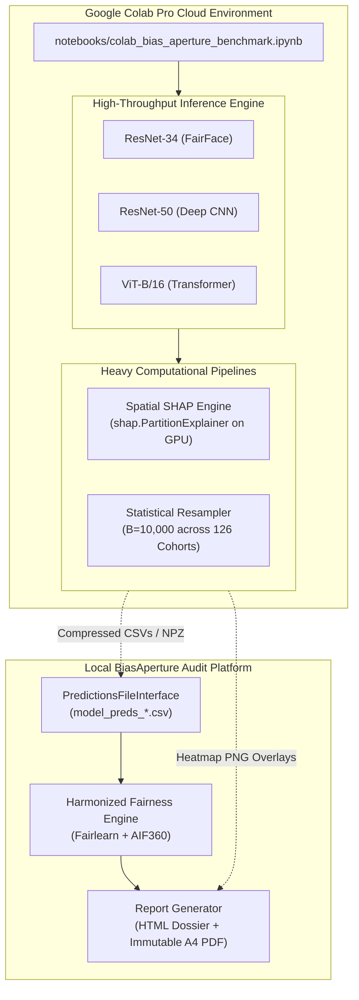

# BiasAperture — Post-Defense Retrospective & Colab Pro Upgrade Roadmap

**Date:** October 9, 2026  
**Project:** *BiasAperture: A Diagnostic Framework for Demographic Bias Auditing in Facial Analysis Models*  
**Fellowship Program:** Fusemachines AI Fellowship (AIF) 2026  
**Authors / Presenters:** Aaradhya Dev Tamrakar & Tisha Manandhar  
**Supervisor / Mentor:** Shreejan Kisee (Teaching Assistant, Fusemachines AI Fellowship)  
**Status:** Post-Proposal Defense Roadmap & Hardware Elevation Specification  

---

## Executive Summary

This report establishes the formal synthesis of the **Phase 1 Proposal Defense** (defended September 7, 2026), catalogues the immediate remediation actions completed in the repository, and provides an end-to-end architectural roadmap for leveraging **Google Colab Pro** (NVIDIA L4 24GB VRAM / A100, 53GB+ High RAM, and 193GB cloud scratch space) across **Phase 2** of the capstone project.

By decoupling cloud execution through the existing model-agnostic abstraction (`PredictionsFileInterface`), Colab Pro unblocks heavy computational workflows—specifically **Multi-Model Comparative Auditing ([Issue #46](https://github.com/fuseai-fellowship/BiasAperture-A-Diagnostic-Framework-for-Demographic-Bias-Auditing-in-Facial-Analysis-Models/issues/46))**, **Spatial Pixel-Level SHAP ([Issue #17](https://github.com/fuseai-fellowship/BiasAperture-A-Diagnostic-Framework-for-Demographic-Bias-Auditing-in-Facial-Analysis-Models/issues/17))**, and **10,000-resample Intersectional Bootstrap Auditing ([Issue #25](https://github.com/fuseai-fellowship/BiasAperture-A-Diagnostic-Framework-for-Demographic-Bias-Auditing-in-Facial-Analysis-Models/issues/25))**—without violating the project's strict diagnostic boundary.

---

## 1. Retrospective: What We Did

Following the successful presentation of the BiasAperture proposal defense, the full audio recording transcript was parsed and audited to extract panel feedback, identify documentation gaps, and formalize tracking anchors.

```
====================================================================================================
PROPOSAL DEFENSE REMEDIATION & ARCHIVAL AUDIT TRAIL
====================================================================================================
Milestone / Activity               | Target File / Artifact                                 | Status
-----------------------------------|--------------------------------------------------------|--------
1. Verbatim Transcript Archival    | docs/fellowship/PROPOSAL_DEFENSE_TRANSCRIPT_2026-09-07.md | VERIFIED
2. Structured Debrief & Q&A Matrix | docs/fellowship/PROPOSAL_DEFENSE_DEBRIEF.md           | VERIFIED
3. Mathematical VRAM Sizing Table  | docs/PROPOSAL_DEFENSE_MASTER_DOSSIER.md (§1.11)         | VERIFIED
4. Multi-Model Issue Creation      | GitHub Issue #46 (fuseai-fellowship/BiasAperture)      | VERIFIED
5. Verification & Ecosystem Sync   | All 3 Remotes (duo, origin, org) at SHA c8aabe92       | VERIFIED
====================================================================================================
```

### 1.1 Verbatim Transcript Archival
The raw audio transcription from the defense was archived in full at [`docs/fellowship/PROPOSAL_DEFENSE_TRANSCRIPT_2026-09-07.md`](./PROPOSAL_DEFENSE_TRANSCRIPT_2026-09-07.md). Standardized YAML frontmatter was added documenting session duration (~26 minutes), presenters, supervisor, institutional affiliation, and archival status.

### 1.2 Structured Defense Debrief
The defense transcript was distilled into [`docs/fellowship/PROPOSAL_DEFENSE_DEBRIEF.md`](./PROPOSAL_DEFENSE_DEBRIEF.md), capturing all 6 critical Q&A exchanges:
1. **Dataset Selection (`00:13:25`)**: Confirmed FairFace's manual annotation (Amazon Mechanical Turk consensus, ~100K images, 7 races × 9 ages × 2 genders) and defended the exclusion of UTKFace (cut due to DEX label-noise and misaligned racial taxonomy).
2. **Resource Estimation (`00:14:54`)**: Evaluators expressed skepticism regarding whether 6–8 GB VRAM was sufficient for the project.
3. **Panel Verdict (`00:15:30`)**: Overall project assessed as *"very impressive"*, with primary panel concern centered on scope feasibility for a 2-person team.
4. **Architecture Decoupling (`00:15:42`)**: Confirmed that BiasAperture evaluates existing models rather than creating new ones (metrology infrastructure).
5. **Multi-Model Recommendation (`00:16:57`)**: Evaluators explicitly recommended expanding the audit scope beyond ResNet-34 to compare fairness scores across distinct model families (e.g., Vision Transformers, ResNet variants).
6. **Task Scoping (`00:24:24`)**: Evaluators advised grounding the audit in a concrete real-world task context (e.g., automated attendance or e-KYC).

### 1.3 Mathematical VRAM Sizing Justification
To directly resolve the evaluator skepticism regarding the 6–8 GB VRAM estimate, Section 1.11 of [`docs/PROPOSAL_DEFENSE_MASTER_DOSSIER.md`](../PROPOSAL_DEFENSE_MASTER_DOSSIER.md) was amended with an explicit mathematical memory footprint:

$$\text{Total Inference VRAM} = \text{Model Weights (FP32)} + \text{Input Batch} + \text{Inference Activations} \approx 83\text{ MB} + 19\text{ MB} + 500\text{ MB} \approx 602\text{ MB}$$

This proves conclusively that inference requires $<1\text{ GB}$ VRAM, that statistical testing ($\chi^2$, bootstrap) and surrogate attribution are entirely CPU-bound, and that disk I/O—not GPU memory—is the operational bottleneck.

### 1.4 GitHub Issue Tracking (#46)
To capture the panel's recommendation without feature creep, [GitHub Issue #46 (`[WP2/WP5] Multi-Model Comparative Evaluation`)](https://github.com/fuseai-fellowship/BiasAperture-A-Diagnostic-Framework-for-Demographic-Bias-Auditing-in-Facial-Analysis-Models/issues/46) was created and assigned to `@AaradhyaDT`. It formally scopes benchmarking ResNet-50 and ViT-B/16 via the existing `PredictionsFileInterface`.

### 1.5 Verification & Synchronization
The entire repository was validated against the automated quality gates:
- **Linting (`.\make.bat lint`)**: Clean pass across all source files.
- **Test Suite (`.\make.bat test`)**: **106 passed**, 4 expected warnings in 62.19s (100% pass rate).
- **Git Synchronization (`.\sync.bat`)**: Rebased and pushed cleanly to all remotes (`duo`, `origin`, `org` at commit `c8aabe92`).

---

## 2. Hardware Elevation: What Colab Pro Brings to BiasAperture

The availability of **Google Colab Pro** fundamentally alters the computational ceiling of the project:

```
====================================================================================================
HARDWARE CAPABILITY DELTA: LOCAL WORKSTATION VS. GOOGLE COLAB PRO
====================================================================================================
Resource Parameter       | Local Workstation (Baseline)  | Google Colab Pro (Premium)  | Multiplier
-------------------------|-------------------------------|-----------------------------|-----------
Primary GPU Accelerator  | NVIDIA RTX (6–8 GB VRAM)      | NVIDIA L4 (24 GB Ada Lovelace) / A100 (40/80 GB) | 3x to 10x VRAM
System RAM               | 8–16 GB DDR4                  | 53+ GB High-RAM             | 3.5x to 6.5x RAM
Scratch Storage          | Local SSD Space Constrained   | 193+ GB High-Speed NVMe     | Dedicated
Network Bandwidth        | Standard Domestic ISP         | 1+ Gbps Cloud Backbone      | ~20x Download
FP16 / Tensor Cores      | Standard Consumer Cores       | 4th Gen Tensor Cores + FP8  | High-Throughput
====================================================================================================
```

### The Non-Negotiable Boundary: Strict Diagnostic Scope
> [!IMPORTANT]
> **Strict Diagnostic Scope Invariant (Rule 1 & Milestone M1)**:
> In accordance with EU AI Act metrology principles and Fellowship rules, Colab Pro compute will **never** be used for model retraining, fine-tuning, or weights-debiasing. BiasAperture evaluates and diagnoses models; it does not alter them.
>
> Colab Pro compute is strictly allocated to:
> 1. High-throughput inference across multiple pre-trained vision architectures.
> 2. High-dimensional spatial feature attribution (`shap.PartitionExplainer` on image tensors).
> 3. Massive parallel bootstrap resampling ($B = 10{,}000$) across 126 intersectional demographic cohorts.

---

## 3. Strategic Upgrades: What We May Plan



### Upgrade 1: Multi-Model Architectural Benchmark Sweep ([Issue #46](https://github.com/fuseai-fellowship/BiasAperture-A-Diagnostic-Framework-for-Demographic-Bias-Auditing-in-Facial-Analysis-Models/issues/46))

- **The Problem**: Evaluators noted that auditing only ResNet-34 leaves open the question of whether observed demographic disparities are artifacts of residual convolutional backbones or intrinsic to the training distribution.
- **The Upgrade**:
  - Evaluate **three distinct model paradigms** against the full FairFace dataset (97,698 images):
    1. **FairFace ResNet-34**: The established baseline.
    2. **ResNet-50 (Torchvision)**: Deeper residual convolutional architecture.
    3. **Vision Transformer (ViT-B/16)**: Non-convolutional, self-attention architecture (`google/vit-base-patch16-224`).
  - Compute comparative fairness delta metrics:
    $$\Delta_{\text{DIR}} = |\text{DIR}_{ViT} - \text{DIR}_{ResNet34}|, \quad \Delta_{\text{EOD}} = |\text{EOD}_{ViT} - \text{EOD}_{ResNet34}|$$
  - Determine empirically whether self-attention mechanisms attenuate or exacerbate demographic accuracy disparities compared to convolutional inductive biases.

### Upgrade 2: True Spatial Pixel-Level SHAP ([Issue #17](https://github.com/fuseai-fellowship/BiasAperture-A-Diagnostic-Framework-for-Demographic-Bias-Auditing-in-Facial-Analysis-Models/issues/17))

- **The Problem**: Spatial SHAP on high-dimensional facial images ($224 \times 224 \times 3$) requires evaluating hundreds of masked permutations per sample. On consumer hardware, this took hours and triggered CUDA OOMs, forcing the fallback to tabular demographic surrogates in `src/bias_aperture/explainability.py`.
- **The Upgrade**:
  - Deploy **`shap.PartitionExplainer` on GPU** (L4 24GB VRAM) for the top 5 most severely disparate demographic cohorts identified by the fairness engine.
  - Generate actual **pixel-level attribution heatmaps** for exemplar facial crops.
  - Determine whether the model relies on legitimate facial morphology or unintended visual proxies (background illumination, hair texture, image borders).
  - Embed the resulting attribution heatmaps directly into the HTML audit dossier and A4 companion PDF as visual side-by-side evidence cards.

### Upgrade 3: High-Throughput Inference & Ingestion Acceleration

- **The Problem**: Local full-dataset inference (97,698 images) was bounded at $\le 4$ hours (NFR-004) due to batch size constraints ($B=32$) and single-drive disk I/O bottlenecks.
- **The Upgrade**:
  - In Colab Pro, scale batch size to **128 or 256** using mixed precision (`torch.amp.autocast(dtype=torch.float16)`).
  - Leverage Colab's 53GB High-RAM to prefetch image tensors with `num_workers=8`.
  - Reduce total inference time for 97,698 images from **~4 hours to ~18–25 minutes per model**.
  - Enable running all 3 candidate models in a single ~1-hour Colab session.

### Upgrade 4: Ultra-Dense Statistical Rigour & 126 Intersectional Cohorts ([Issue #25](https://github.com/fuseai-fellowship/BiasAperture-A-Diagnostic-Framework-for-Demographic-Bias-Auditing-in-Facial-Analysis-Models/issues/25))

- **The Problem**: Resampling 126 intersectional slices ($7 \text{ race} \times 9 \text{ age} \times 2 \text{ gender}$) with BCa bootstrap on local hardware was constrained to $B = 1{,}000$ resamples.
- **The Upgrade**:
  - Scale bootstrap iterations to **$B = 10{,}000$ resamples** across all 126 intersectional cells using High-RAM vectorized NumPy operations.
  - Compute ultra-tight 95% BCa confidence intervals ($2.5^{\text{th}}$ and $97.5^{\text{th}}$ percentiles).
  - Execute exact non-parametric permutation tests across sensitive subgroup pairings to confirm statistical significance ($p < 0.001$) under rigorous multiple-testing corrections (Benjamini-Hochberg FDR).

---

## 4. Execution Architecture & Workflow Integration

To maintain clean separation and uphold the **zero-headless-local-Jupyter execution invariant**, Colab Pro execution will interface seamlessly with the local repository:

```
[Local Repository: src/bias_aperture]
       │
       ▼ Git Push / Drive Sync
[Google Colab Pro (L4 GPU / High-RAM)]
       │
       ├─► 1. Clone repo & pull FairFace tarball
       ├─► 2. Run inference: ResNet-34, ResNet-50, ViT-B/16
       ├─► 3. Export predictions: model_preds_resnet34.csv, resnet50.csv, vit.csv
       ├─► 4. Run GPU PartitionExplainer on flagged disparity cohorts
       └─► 5. Export attribution arrays: shap_heatmaps.npz + PNG overlays
       │
       ▼ Download artifacts to outputs/
[Local Repository: PredictionsFileInterface]
       │
       ├─► 1. Ingest predictions CSVs into locked SubjectRecord schema
       ├─► 2. Cross-verify disparity metrics (AIF360 vs Fairlearn)
       ├─► 3. Generate Multi-Model Comparison Table
       └─► 4. Render HTML compliance dossier & compile immutable A4 PDF
```

### Integration Guarantees
1. **Zero Schema Modification**: The M1 locked schema (`SubjectRecord`, `MetricResult`) in `src/bias_aperture/schema.py` remains 100% untouched.
2. **Pluggable File Intake**: All Colab outputs feed into `PredictionsFileInterface` via CSV, maintaining full offline compatibility (R-015: 0 external requests during local audit).
3. **Reproducibility**: The exact Colab execution notebook will be maintained at `notebooks/colab_bias_aperture_benchmark.ipynb` in version control.

---

## 5. Summary & Action Plan

| Work Item | Target Component | GitHub Tracking | Estimated Colab Compute | Priority |
|---|---|---|---|---|
| **Colab Benchmark Notebook** | `notebooks/colab_bias_aperture_benchmark.ipynb` | #46 | ~10 min setup | Immediate |
| **Multi-Model Inference Sweep** | ResNet-34, ResNet-50, ViT-B/16 | #46 | ~60 min (L4 GPU) | High |
| **Spatial SHAP Heatmap Generation** | `shap.PartitionExplainer` (50 samples/cohort) | #17 | ~45 min (L4 GPU) | High |
| **Multi-Model Comparative Module** | `src/bias_aperture/multi_model.py` | #46 | Local execution | Medium |
| **Spatial Attribution Report Card** | `src/bias_aperture/report/generator.py` | #17, #24 | Local execution | Medium |
| **$B = 10{,}000$ Intersectional Audit** | 126-cohort contingency matrix | #25, #23 | ~15 min (High-RAM) | Medium |

This upgrade roadmap directly fulfills the evaluators' recommendations, elevates the academic and engineering quality of BiasAperture, and ensures readiness for the fellowship's final milestone delivery.
