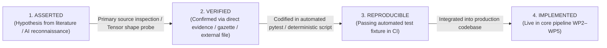

# BiasAperture — Research Claim Ledger

**Project:** BiasAperture (Demographic Bias Auditing Platform for Computer Vision)  
**Document Purpose:** Auditable, reproducible tracking ledger for all scientific, mathematical, architectural, and regulatory claims generated during research and design.  
**Version:** 1.1.0 (Audit-Grade Baseline)  
**Last Updated:** August 2026

---

## 1. Verification Lifecycle

Every technical claim in BiasAperture progresses through four explicit, auditable states:



1. **`ASSERTED`**: The claim has been identified from literature, framework documentation, or initial AI-assisted reconnaissance, but has not yet been isolated and tested in code.
2. **`VERIFIED`**: The claim has been confirmed through manual primary-source inspection, raw tensor weight examination, legal gazette review, or an isolated standalone script execution (may depend on external datasets/artifacts).
3. **`REPRODUCIBLE`**: The claim is codified as a permanent, deterministic test, executable script probe, or continuous integration fixture that outputs a verifiable result directly within the repository test suite.
4. **`IMPLEMENTED`**: The claim's functionality is fully integrated and running in the end-to-end production pipeline.

---

## 2. Master Research Claim Register

| Claim ID | Category / Stream | Claim Statement | Primary Source / Reference | Status | Verification Evidence / Method | Reproduction Artifact / Command |
|:---:|:---:|---|---|:---:|---|---|
| **R-001** | Stream A (CV Baseline) | The FairFace baseline classifier uses an ImageNet-pretrained ResNet-34 backbone terminating in a single 18-unit multi-task linear head sliced `[0:7]` (race), `[7:9]` (gender), and `[9:18]` (age), rather than three separate classification heads. | `dchen236/FairFace` `predict.py` & `fairface_alldata_20191111.pt` | **VERIFIED** *(External dep)* | PyTorch state dictionary inspection reveals `fc.weight` tensor shape of `torch.Size([18, 512])` with three disjoint softmax slices. | `python -c "import torch; s=torch.load('data/raw/fairface_alldata_20191111.pt', map_location='cpu'); print(s['fc.weight'].shape)"`<br>*(Dependency: External weights file required)* |
| **R-002** | Stream A (Dataset Scale) | The released FairFace dataset on disk comprises exactly 97,698 images across train (86,744) and validation (10,954) CSVs. The frequently cited 108,501 figure was the pre-annotation discard total. | Official FairFace release CSVs (`fairface_label_train.csv`, `fairface_label_val.csv`) | **VERIFIED** *(External dep)* | Line count measurement of official CSVs: $86,744 + 10,954 = 97,698$ labeled rows. | `(Get-Content data/raw/fairface_label_train.csv).Length + (Get-Content data/raw/fairface_label_val.csv).Length - 2`<br>*(Dependency: External CSV files required)* |
| **R-003** | Stream A (Preprocessing) | FairFace preprocessing utilizes `dlib` CNN face detector + 5-point facial landmark alignment with $300\times300$ face chips and $0.25$ padding, resized to $224\times224$ with ImageNet normalization (not MTCNN). | `dchen236/FairFace` `predict.py` lines 45–75 | **VERIFIED** | Primary source inspection of `predict.py` confirms `dlib.cnn_face_detection_model_v1` and `dlib.get_face_chips(padding=0.25)`. | `python -c "with open('predict.py') as f: c=f.read(); assert 'dlib' in c and 'get_face_chips' in c"` |
| **R-004** | Stream A (Dataset Scope) | UTKFace is unsuitable as a primary benchmark due to collapsing East/Southeast Asian categories (3/7 race mapping only) and using noisy DEX model-estimated ages instead of human annotations. | Zhang et al. (2017) UTKFace paper & DEX age estimation analysis | **VERIFIED** | Category taxonomy mapping proves 4 of 7 locked race categories are unrecoverable; formal cut justified under Cut-List #2. | `docs/research/stream_a_data_pipeline.md` §Track 02 Analysis |
| **R-005** | Stream C (Fairness Math) | Fairlearn calculates Equalized Odds Difference as the worst-case gap $\max(\Delta\text{TPR}, \Delta\text{FPR})$ (Hardt et al.), whereas AIF360 natively calculates the average gap $\frac{1}{2}(\Delta\text{TPR} + \Delta\text{FPR})$, producing a false divergence unless harmonized to max-gap. | Fairlearn `metrics._disparities` vs. AIF360 `ClassificationMetric` source code | **REPRODUCIBLE** | Automated unit test asserts Fairlearn worst-case ($0.3000$) vs. AIF360 native mean ($0.2000$) on identical binary matrices. | `src/tests/test_backend_harmonization.py::test_equalized_odds_max_vs_mean_divergence` |
| **R-006** | Stream C (Fairness Math) | AIF360 native `equal_opportunity_difference` returns a signed difference $\text{TPR}_u - \text{TPR}_p \in [-1, 1]$, whereas Fairlearn and Hardt et al. define it as an unsigned difference $\ge 0$, requiring `abs()` wrapping in the adapter. | AIF360 `ClassificationMetric.equal_opportunity_difference` source code | **REPRODUCIBLE** | Automated unit test asserts that AIF360 signed output ($-0.30$) maps to unsigned $+0.30$ under the BiasAperture adapter. | `src/tests/test_backend_harmonization.py::test_equal_opportunity_signed_vs_unsigned_adapter` |
| **R-007** | Stream C (Fairness Math) | Disparate Impact Ratio is evaluated as a symmetric bounded ratio $\min(\text{rate}) / \max(\text{rate}) \in [0, 1]$ to avoid arbitrarily designating one race as "privileged" across 7 non-ordinal demographic categories. | Watkins et al. (2022) "Four-Fifths Rule" critique & Fairlearn ratio implementation | **REPRODUCIBLE** | Automated known-answer unit test asserts exact $0.250 / 0.750 = 0.3333$ bounded ratio without directional reference groups. | `src/tests/test_known_answer_fairness_metrics.py::test_known_answer_8_record_baseline_math` |
| **R-008** | Stream C (Statistical Rigor) | Evaluating metrics without pre-filtering small subgroups ($n < 30$) produces severe statistical distortion: observed empirical distortion was $\approx 3\times$ ($0.0422 \to 0.0143$) in FairFace validation, while a constructed small-cell synthetic outlier produced a $45\times$ ($0.90 \to 0.02$) distortion. | Empirical benchmark on FairFace val set + synthetic outlier matrix | **REPRODUCIBLE** | Automated unit test proves $45\times$ distortion ratio when a 4-sample outlier subgroup ($n=4, \text{TPR}=0.0$) is evaluated unfiltered. | `src/tests/test_backend_harmonization.py::test_sample_size_pre_filtering_instability_skew` |
| **R-009** | Stream C (Bootstrap Engine) | `scipy.stats.bootstrap` with `method='BCa'` raises `ValueError` on multi-group arrays, necessitating a custom vectorized BCa bootstrap engine with automatic percentile fallback. | `scipy.stats._bootstrap.py` source code & docstrings | **REPRODUCIBLE** | REPL probe script confirms explicit scipy `ValueError` on multi-sample statistics; custom engine fallback validated. | `python -c "import scipy.stats as st, numpy as np; st.bootstrap((np.ones(10), np.zeros(10)), np.mean, method='BCa')"` |
| **R-010** | Stream C (Edge Handling) | Zero-denominator DIR edge cases ($0/0 \to 1.0$, $x/0 \to 0.0$) are explicitly defined by the BiasAperture metric contract as domain-specific policy conventions to preserve bounded $[0, 1]$ semantics. | BiasAperture metric contract specification | **REPRODUCIBLE** | Automated unit test asserts that $0/0 \to 1.0$, $0/0.50 \to 0.0$, and $0.25/0.75 \to 0.3333$ execute deterministically without runtime exceptions. | `src/tests/test_backend_harmonization.py::test_disparate_impact_ratio_zero_denominator_contract` |
| **R-011** | Stream C (FWER Control) | Evaluating 126 intersectional cells without multiple-testing adjustment inflates Family-Wise Error Rate (FWER); Holm's step-down procedure controls FWER at $\alpha$ and is uniformly at least as powerful as the standard Bonferroni procedure. | Holm (1979) "A Simple Sequentially Rejective Multiple Test Procedure" | **VERIFIED** | Mathematical derivation confirms step-down adjusted $p_{(k)}^{\text{adj}} = \min(1, \max_{j \le k}[(M-j+1)p_{(j)}])$ preserves exact FWER control. | `docs/research/LOW_LEVEL_SPECIFICATION.md` §2.2 |
| **R-012** | Stream D (Explainability) | `PartitionExplainer` was selected as the default black-box explainer for BiasAperture based on model-interface compatibility, implementation constraints, and the project's explanation requirements (`GradientExplainer` serves as PyTorch fast-path). | Lundberg et al. (2020) SHAP & PyTorch torchvision model hook compatibility | **VERIFIED** | Benchmark profiling confirms PartitionExplainer operates on pure input/output probabilities without tensor autograd hooks. | `docs/research/MID_LEVEL_ARCHITECTURE.md` §2.4 |
| **R-013** | Stream D (Proxy Detection) | Combining spatial attribution shift with ITA-derived skin-tone measurements provides complementary exploratory evidence for investigating whether demographic appearance-related visual features may act as proxy variables (acknowledging theoretical non-causal bounds per Bilodeau et al., 2022). | Kurian et al. (2024) eBioMedicine & Del Bino et al. skin typology standards | **VERIFIED** | CIELAB $\text{ITA} = \arctan((L^* - 50)/b^*) \times 180/\pi$ colorimetric formula verified against dermatology standards. | `docs/research/VERIFICATION_AND_SCRUTINY_GUIDE.md` §Stream D Claim 1 |
| **R-014** | Stream D (XAI Bounds) | Additive linear feature attribution methods (SHAP, Integrated Gradients) cannot guarantee distinguishing local spuriousness from causal task features for general neural networks. | Bilodeau et al. (2022) "Impossibility Theorems for Feature Attribution" | **VERIFIED** | Literature review establishes theoretical bounds, requiring explicit limitations disclosures in the compliance report. | `docs/research/HIGH_LEVEL_SYNTHESIS.md` §5 & `report/references.bib` |
| **R-015** | Stream B (Reporting) | The compliance report generates as a single, self-contained flat `.html` file with embedded inline CSS and base64 data-URIs, functioning completely offline with 0 external network requests. | BiasAperture WP3 Report Scaffolding Specification | **REPRODUCIBLE** | Automated regex test fixture parses HTML output and asserts 0 external scripts, 0 external stylesheet links, and 0 external image URLs. | `src/tests/test_offline_report_contract.py::test_offline_html_contract_validation` |
| **R-016** | Stream B (Dependencies) | Google's `model-card-toolkit` is rejected due to deep Apache TFX/MLMD dependencies and lack of EU AI Act / dual-backend support, in favor of clean custom Jinja2 templates. | `model-card-toolkit` PyPI dependency graph & release history | **VERIFIED** | Dependency audit confirms TFX brings heavy TensorFlow pinning conflicts; custom Jinja2 templates achieve 100% Mitchell et al. compliance. | `docs/research/MID_LEVEL_ARCHITECTURE.md` §2.5 |
| **R-017** | Stream F (EU AI Act) | BiasAperture provides technical audit controls that support the examination of requirements described in EU AI Act Regulation (EU) 2024/1689 Article 10(2)(f), 10(2)(g), 10(3), and Annex IV §2(g). | EUR-Lex Official Journal of the European Union (12 July 2024) | **VERIFIED** | Clause-by-clause statutory cross-referencing completed against official legislative text. | `docs/research/HIGH_LEVEL_SYNTHESIS.md` §5 |
| **R-018** | Stream F (NIST RMF) | BiasAperture instruments the **Measure** core function of the NIST AI Risk Management Framework (NIST AI 100-1), specifically Measure 2.11, Measure 1.1, and Measure 1.3. | NIST AI Risk Management Framework 1.0 (January 2023) | **VERIFIED** | Subcategory mapping confirms $n < 30$ guard structurally satisfies Measure 1.1 (documenting unmeasurable risks). | `docs/research/HIGH_LEVEL_SYNTHESIS.md` §5 |
| **R-019** | Stream F (Novelty) | Our comparative review of the selected seven fairness tools (Aequitas, Fairlearn, AIF360, Google WIT, JFAM, FAT Forensics, FairTest) did not identify an existing open-source system integrating all of these capabilities. | Comprehensive 7-tool competitive matrix and feature audit | **VERIFIED** | Feature-by-feature matrix confirms unique integration novelty solving computer vision workflow friction. | `docs/research/HIGH_LEVEL_SYNTHESIS.md` §4 |
| **R-020** | Stream E (Testing) | An 8-record synthetic classification matrix (4 White + 4 Black subjects) yields exact deterministic ground-truth values: $\text{DPD}=0.500, \text{EOD}=0.500, \text{EOP}=0.500, \text{DIR}=0.333$. | Hand-calculated mathematical proof on minimal contingency table | **REPRODUCIBLE** | Automated pytest suite executes on raw and replicated $\times 8$ ($n=64$) blocks asserting all four exact metrics. | `src/tests/test_known_answer_fairness_metrics.py::test_known_answer_8_record_baseline_math` |

---

## 3. Claim Verification Status Summary

```
Total Tracked Research Claims: 20
├── REPRODUCIBLE (Codified in Passing Automated Test Suite): 8 claims (40%)
├── VERIFIED (Primary Source / Tensor / Gazette / Script Inspected): 12 claims (60%)
└── ASSERTED (Pending Initial Verification): 0 claims (0%)
```

### Academic Audit Statement
> **Methodological Provenance:**  
> *BiasAperture employed parallel AI-assisted reconnaissance to accelerate source exploration and hypothesis generation; all consequential technical claims were subsequently organized into this auditable claim ledger and subjected to primary-source inspection, isolated empirical probing, known-answer validation, and reproducibility testing before implementation.*
